<section>

### První dojmy

</section>

<section>

„Musí se začínat od začátku,“ radil mi kdysi mistr Chauliac; ale jelikož jsem už deset dní na tomto babylonském ostrově, ztratil se mi začátek. Čím mám nyní začít? Opečeným špekem nebo výstavou ve Wembley? Panem Shawem nebo londýnskými strážníky? Vidím, že začínám velmi zmateně; ale co se týče těch strážníků, musím říci, že jsou rekrutováni podle krásy a velikosti; jsou jako bohové, o hlavu větší než lidé smrtelní, a jejich moc je neomezená; když takový dvoumetrový Bob na Piccadilly zvedne ruku, zastaví se všechny vehikly, utkví Saturn a Uran stane na své nebeské dráze čekaje, až Bob tu ruku spustí. Nikdy jsem neviděl něco tak nadlidského.

Největší překvapení cestovatele je, najde-li v cizí zemi to, o čem stokrát četl nebo co stokrát viděl na obrázku. Užasl jsem, když jsem v Miláně našel milánský dóm nebo Koloseum v Římě. Je to poněkud příšerný dojem, protože člověk má pocit, že už tu někdy byl nebo že to už jednou nějak zažil, snad ve snu nebo kdy. Zarazí tě, že v Holandsku jsou opravdu větrné mlýny a kanály a že na londýnském Strandu je opravdu tolik lidí, že ti je z toho špatně. Jsou dva zcela fantastické dojmy: nalézt něco neočekávaného a nalézt něco hodně známého. Člověk se vždycky nahlas podiví, když zničehonic potká starého známého. Nuže, stejně jsem se podivil, když jsem nad Temží našel Parlament, na ulicích gentlemany v šedivých cylindrech, na křižovatkách dvoumetrové Boby a tak dále. Byl to překvapující objev, že Anglie je opravdu anglická.

Ale abych přece jen začal od začátku, tedy nakreslil jsem vám obrázek, jak vypadá Anglie, když se k ní blížíte z Kanálu. To bílé jsou prostě skály a nahoře roste tráva; je to sice stavěno dosti důkladně, tak říkajíc na skále, ale mít pod nohama kontinent, lidi, to je přece jen solidnější pocit.

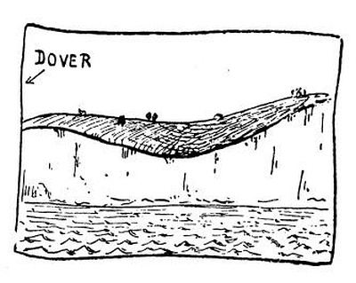  

Dále jsem vám nakreslil Folkestone, kde jsem přistál. V západu slunce to vypadalo jako hrad a cimbuří; později se ukázalo, že to jsou komíny.

Vystoupiv na zem shledal jsem s úžasem, že neumím a nerozumím ani slovo anglicky. Ukryl jsem se tedy do nejbližšího vlaku; naštěstí se ukázalo, že jede do Londýna. Cestou shledávám, že to, co jsem považoval za Anglii, je vlastně jenom velký anglický park: samé louky a palouky, překrásné stromy, staleté aleje a sem tam ovce, tak jako v Hyde Parku, patrně pro zvýšení dojmu. Ještě v Holandsku jsem viděl lidi zvedající zadky k nebi a pracující rukama v hlíně. Tu a tam jsou červené vilky; děvče kývá přes živý plot, alejí jede cyklista, jinak je tu kupodivu poskrovnu lidí; člověk od nás je zvyklý, že se na každé pídi země někdo mrví v hlíně. Konečně se vlak zavrtává mezi jakési divné domky; je jich sto docela stejných; pak zase celá ulice stejných; a zase; a zase. Dělá to dojem horečného násobení. Vlak letí kolem celého města, na němž leží nějaká hrozná kletba; neboť každý domek má u dveří z jakési zoufalé nutnosti dva sloupy. Další blok je zaklet k tomu, aby nesl samé železné balkony. Následující blok je navždy odsouzen k šedivým cihlám. Další ulici je určen zádumčivý a neodvratný osud mít modré verandy. Pak je celá čtvrť, jíž je pro nějakou neznámou vinu uloženo mít u každých dveří pět stupňů. Nesmírně by mi ulevilo, kdyby některý domek měl jenom tři; ale není to z jakési příčiny možno. A další ulice je celá červená.

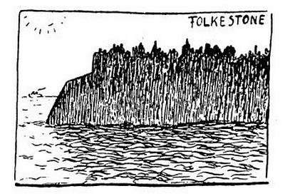  

Potom tedy jsem vystoupil z vlaku, padl do náručí dobrého českého anděla strážce, byl veden vpravo a vlevo, nahoru a dolů; říkám vám, je to děsné. Naložili mne do vlaku a vyndali mne v Surbitonu, těšili, krmili a uložili mne do peřin; i byla tma jako u nás, ticho jako u nás, a sny, které jsem měl, byly všelijaké, něco o lodi, něco o Praze a něco divného, co jsem už zapomněl.

Chvála Bohu, že jsem neměl padesát stejných snů jeden za druhým. Buďte nebesa pochválena, že se aspoň sny nevyrábějí en gros jako londýnské ulice.

### Anglický park

</section>

<section>

Stromy jsou snad to nejkrásnější v Anglii. Také ovšem louky a strážníci, ale hlavně stromy, krásně plecité, staré, rozložité, volné, ctihodné a převeliké stromy. Stromy v Hampton Courtu, Richmond Parku, Windsoru a já nevím kde ještě. Možná že ty stromy mají velký vliv na torysmus v Anglii. Myslím, že udržují aristokratické pudy, historismus, konzervativnost, celní ochranu, golf, dům lordů a jiné zvláštní a staré věci. Byl bych asi náruživým labouristou, kdybych bydlil v ulici Železných Balkonů nebo v ulici Šedivých Cihel; ale sedě pod dubem křemelákem v Hampton Parku pocítil jsem v sobě povážlivou náklonnost uznávat hodnotu starých věcí, vyšší poslání starých stromů, harmonickou košatost tradice a jakousi úctu ke všemu, co je dosti silné, aby se udrželo po věky.

Zdá se, že v Anglii je mnoho takových prastarých stromů; skoro ve všem, co tu člověk potkává, v klubech, v literatuře, v domácnostech, je nějak cítit dřevo a listí staletých, ctihodných a strašně solidních stromů. Tady vlastně člověk nevidí nic okázale nového; jenom podzemní dráha je nová, a proto asi je tak ošklivá. Ale staré stromy a staré věci mají v sobě skřítky, duchy výstřední a šprýmovné; také Angličané mají v sobě skřítky. Jsou nesmírně vážní, solidní a ctihodní; najednou to v nich nějak zaharaší, řeknou něco pitvorného, vyletí z nich drobet skřítkového humoru, a už zas vypadají vážně jako stará kožená židle; jsou asi ze starého dřeva.

Nevím ani proč, ale tato střízlivá Anglie mi připadá nejpohádkovější a nejromantičtější ze všech zemí, které jsem viděl. Snad je to pro ty staré stromy. Nebo ne: to asi dělají trávníky. To dělá to, že se tady chodí po lukách místo po cestičkách. My ostatní si troufáme chodit jen po cestách a pěšinách; to má jistě ohromný vliv na náš duševní život. Když jsem viděl prvního gentlemana brouzdat se po trávníku v Hampton Parku, myslil jsem, že je to pohádkový tvor, ačkoli měl cylindr; čekal jsem, že pojede do Kingstonu na jelenu nebo že začne tančit, nebo že na něj přijde zahradník a strašně mu vynadá. Nestalo se nic, a konečně i já jsem se odvážil pustit se rovnou přes louku k onomu dubu křemeláku, který stojí na začátku tohoto listu na krásném palouku. Nestalo se nic dál; ale nikdy jsem neměl pocit tak neomezené svobody jako v tomto okamžiku. Je to velmi zvláštní: tady patrně člověk neplatí za škodné zvíře. Tady není o něm ponuré mínění, že pod jeho kopyty tráva neroste. Tady má právo jít po louce, jako by byl rusalka nebo velkostatkář. Myslím, že to má značný vliv na jeho povahu a světový názor. Otvírá to zázračnou možnost jít jinudy než cestou, a přitom sebe sama nepovažovat za škodnou, rošťáka nebo anarchistu.

O tom všem jsem přemítal pod dubem v Hampton Parku, ale posléze i staré kořeny tlačí. Posílám vám aspoň obrázek, jak takový anglický park vypadá. Chtěl jsem tam nakreslit také jelena, ale přiznávám se, že jej zpaměti nedovedu.

  

### Londýnské ulice

</section>

<section>

Pokud se pak týče Londýna samotného, páchne povšechně benzínem, spálenou trávou a lojem, na rozdíl od Paříže, kde k tomu přistupuje zápach pudru, kávy a sýra. V Praze páchne každá ulice jinak; po této stránce není nad Prahu. Složitější je to s hlasy Londýna: tam uvnitř, na Strandu nebo na Piccadilly, to vám je, lidi, jako přádelna s tisíci vřeteny; to to drnčí, rachotí, přede, bublá, sviští a hrčí tisíci nacpanými motory, busy, auty a parními mašinami; a vy sedíte na střeše busu, který nemůže dál a drnčí naprázdno, protřásáte se jeho rachotem a poskakujete na místě jako divná vycpaná loutka. Pak jsou postranní ulice, gardens, squares, roads a groves a crescents až po tu mizernou ulici v Notting Hillu, kde toto píši: všeliké ulice Dvou Sloupů, ulice Stejných Mříží, ulice Sedmi Schůdků Před Každým Domkem a tak dále; nuže, zde jakési zoufalé variace na „i “ ohlašují prodavače mléka, bědující „jejej“ znamená prostě třísky na zatápění, „uó“ je válečný křik uhlíře, a příšerný řev delirantního námořníka zvěstuje, že nějaký chlapík veze na prodej pět hlávek kapusty v dětském kočárku. A v noci se tu milují kočky stejně divoce jako na střechách Palerma, přes všechny pověsti o anglickém puritánství. Jen lidé jsou tady tišší než jinde; mluví spolu jen na půl huby a koukají, aby už byli doma. A to je to nejpodivnější na anglických ulicích: tady neuvidíte ctihodné dámy povídat si na rohu o tom, co se stalo u Smithů nebo Greenů, ani somnambulně putovat milence čtyřručně se vedoucí, ani sedět na zápraží počestné občany s rukama na kolenou (mimochodem: tady jsem ještě neviděl truhláře, ani zámečníka, ani dílny, ani tovaryše, ani učně; tady jsou jen krámy, samé krámy, samá Westminster Bank a Midland Bank Ltd.), ani muže pijící na ulici, ani lavičky na rynku, ani zevlouny, ani povalovače, ani služky, ani penzisty, zkrátka nic, nic, nic; londýnská ulice je jen takové koryto, kterým život teče, aby už byl doma. Na ulicích se nežije, nekouká, nemluví, nestojí ani nesedí; ulicemi se jenom probíhá. Tady ulice není ten nejzajímavější lokál, kde vás potká tisícerá podívaná a promluví k vám tisíc dobrodružství; lokál, kde lidé pískají nebo se perou, hlučí, koketují, odpočívají, básní nebo filozofují, chodí na stranu a užívají života a dělají vtipy nebo politiku a shlukují se ve dvojice, v trojice, v rodiny, v zástupy nebo v revoluce. U nás, v Itálii, ve Francii je ulice jakási velká hospoda nebo veřejný sad, náves, shromaždiště, hřiště a divadlo, rozšířený domov a zápraží; tady je něčím, co nepatří nikomu a nikoho nesbližuje s ostatními; tady nepotkáváte lidi a věci, zde je jenom míjíte.

Člověk u nás vystrčí hlavu z okna, a už je na ulici. Ale anglický domov není od ulice oddělen jen záclonou v okně, nýbrž ještě zahrádkou a mříží, břečťanem, trávníčkem a živým plotem, klepátkem na dveřích a odvěkou tradicí. Anglický domov musí mít svou vlastní zahrádku, neboť ulice mu není divým a rozkošným sadem; musí mít na zahrádce svou vlastní houpačku nebo hřiště, protože ulice mu není hřištěm ani zábavnou skluzavkou. Poezie anglického domova je zaplacena tím, že anglická ulice je bez poezie. A tady nikdy nepotáhnou ulicemi revoluční davy, protože ty ulice jsou na to příliš dlouhé. A příliš fádní.

  

Ještěže tu jsou busy, koráby pouště, velbloudi nesoucí vás na hřbetě skrze cihelnou nekonečnost Londýna. Je mi jednou ze záhad, že si nespletou cestu, ačkoli se většinou neřídí podle slunce ani podle hvězd, vzhledem ke zdejší oblačnosti. Nevím dosud, podle jakých tajných známek rozezná řidič Ladbroke Grove od Great Western Road nebo Kensington Park Street. Nevím, proč dává přednost tomu, ujíždět do East Actonu, místo aby jel do Pimlica nebo Hammersmithu. Je to totiž všechno tak podivně stejné, že nechápu, proč se vlastně specializoval na East Acton. Snad tam má domek, jeden z těch se dvěma sloupky a sedmi stupni u dveří. Ty domky vypadají trochu jako rodinné hrobky; pokusil jsem se je nakreslit, ale ať jsem dělal co chtěl, nedosáhl jsem výrazu dosti beznadějného; mimoto nemám s sebou šedivou barvu, kterou bych je natřel.

Abych nezapomněl: Ovšemže jsem se byl podívat na Baker Street, a vrátil jsem se strašlivě zklamán. Není tam ani stopy po Sherlocku Holmesovi; je to bezpříkladně počestná obchodní ulice, jež nemá vyššího cíle než ústit do Regent’s Parku, což se jí po dlouhém úsilí téměř povede. Dotkneme-li se ještě stručně její podzemní stanice, vyčerpali jsme vše, i svou trpělivost.

### Traffic

</section>

<section>

Ale jakživ se nesmířím s tím, čemu se tady říká „traffic“, totiž s frekvencí na ulicích. Vzpomínám s hrůzou na den, kdy mne poprvé dovezli do Londýna. Nejdřív mne vezli vlakem, pak běželi nějakými nesmírnými zasklenými halami a strčili mne do mřížové klece, jež vypadá jako dobytčí váha; to je lift, a jelo to dolů ošklivou pancéřovou studní, načež mne vytáhli a prchali křivolakými podzemními chodbami; bylo to jako hrozný sen. Pak tam byl takový tunel nebo kanál s kolejemi, a tam přiletěl bručící vlak; hodili mne do něho a vlak letěl dál, a bylo tam těžké a plesnivé dusno, patrně z blízkosti pekla; načež mne znovu vyndali a běželi novými katakombami až k pohyblivým schodům, jež rachotí jako mlýn a ženou se do výše i s lidmi; říkám vám, je to jako horečka. Pak ještě několik chodeb a schodišť, a přes můj odpor mne vyvedli na ulici, kde mi kleslo srdce. Bez konce a přerušení se sune čtyřnásobný pás vehiklů: busy, supající mastodonti řítící se ve stádech s hejny lidiček na zádech; předoucí auta, náklady, parní mašiny, cyklisti, busy, busy, letící smečka aut, běžící lidé, traktory, ambulance, lidé šplhající jako veverky na střechy busů, nové stádo motorových slonů, tak, a teď to všechno stojí, mručící a drnčící příval, a nemůže to dál; ale ani já nemohu dál, vzpomínaje na hrůzu, kterou tehdy ve mně vzbudila představa, že musím přeběhnout na druhou stranu ulice. Podařilo se to s jistým úspěchem, a od té doby jsem bezpočtukrát překřižoval londýnské ulice; ale jakživ se s nimi nesmířím.

  

Tehdy jsem se vracel z Londýna zdrcen, zoufalý, zhroucen na duchu i na těle; poprvé v životě jsem pocítil slepý a zuřivý odpor k moderní civilizaci. Zdálo se mi, že je něco barbarského a katastrofálního v tom strašném nakupení lidí; prý jich je tady sedm a půl milionu, ale já jsem je nepočítal. Vím jenom, že první dojem z této veliké hromady byl skoro tragický; bylo mi úzko a bezmezně se mi zastesklo po Praze, jako když se malé dítě ztratí v lese. Ano, beze všeho se vám přiznám, že jsem se bál: bál jsem se, že se ztratím, že mne přejede autobus, že se mi něco stane, že jsem ztracen, že lidský život nemá ceny, že člověk je zvětšená bakterie hemžící se po milionech na nějakém plesnivém bramboru, že to je snad jen ošklivý sen, že lidstvo vyhyne nějakou hroznou katastrofou, že člověk je bezmocný, že se dám pro nic za nic do pláče a že se mi všichni budou smát: všech sedm a půl milionu lidí. Snad jednou později pochopím, co mne tak na první pohled vyděsilo a naplnilo nekonečnou úzkostí; ale dobrá, dnes jsem si už trochu zvykl, jdu, běžím, uhýbám, jezdím, šplhám na střechy vehiklů nebo se řítím lifty a tubami jako každý jiný, ale jen za jednu cenu: že na to nesmím myslit. Jakmile si chci uvědomit, co se kolem mne děje, mám zase mučivý pocit něčeho špatného, obludného a katastrofálního, s čím si nevím rady. A pak se mi, víte, nesnesitelně stýská.

A někdy se to všechno zastaví třeba na půl hodiny: prostě proto, že toho je příliš mnoho. Někdy na Charing Cross se udělá uzel, a než to rozmotají, nastaví se vozidel od Banky až někam po Brompton, a vy zatím můžete ve svém vehiklu přemýšlet, jak to bude vypadat za dvacet let. Protože taková zácpa nastane patrně tuze často, přemýšlí o tom mnoho lidí. Není dosud rozhodnuto, bude-li se chodit po střechách nebo pod zemí; jenom to je jisto, že na zemi to už nejde, což je pozoruhodná vymoženost moderní civilizace. Co mne se týče, dávám přednost zemi, jako obr Anteus. Nakreslil jsem vám obrázek, ale ve skutečnosti to vypadá ještě hůře, neboť to hlučí jako továrna; šoféři však netroubí jako blázni a lidé nikterak nenadávají; je to přece jen klidný lid.

Zatím jsem mimo jiné rozluštil, že divý křik „o-ej-ó “ na ulici znamená brambory, „oi“ je olej a „u -ú “ je láhev s něčím záhadným. A někdy se na největší ulici postaví na kraji chodníku celá kapela a hraje, fouká do trumpet, bubnuje a vybírá penny; nebo si stoupne před okna taliánský tenor a zpívá Rigoletta, Troubadoura nebo horoucí píseň touhy „To jsem se škrábla“, docela jako v Neapoli. Zato však jsem potkal jediného člověka, který si hvízdal; bylo to na Cromwell Road a byl to černoch.

### Hyde Park

</section>

<section>

A když mně bylo nejsmutněji v zemi anglické – bylať anglická neděle zamořená nevýslovnou nudou –, pustil jsem se po Oxford Street; chtěl jsem jít prostě na východ, abych byl blíže vlasti, ale spletl jsem si směr a putoval jsem přímo k západu, pročež jsem se ocitl u Hyde Parku; říká se tam Marble Arch, protože je tam mramorová brána, která nikam nevede; nevím vlastně, proč tam stojí. Bylo mi jí poněkud líto, i šel jsem se na ni podívat; a při tom jsem to uviděl, a běžel jsem se tam kouknout, protože tam byly zástupy lidu. A když jsem pochopil, co se děje, bylo mi hnedle radostněji.

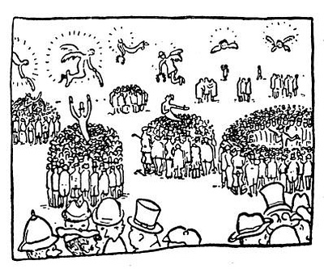  

To je takové velké prostranství, a kdo chce, může si přinésti židli nebo řečniště nebo vůbec nic a může začít povídat. Za chvíli ho poslouchá pět nebo dvacet nebo tři sta lidí, odpovídají mu, odporují, kývají hlavami a někdy zpívají s řečníkem pobožné nebo světské hymny. Někdy oponent získá lid na svou stranu a chopí se slova sám; někdy se zástup dělí pouhým štěpením nebo pučením jako nejnižší organismy a buněčné kolonie. Některé hloučky mají pevnou a vytrvalou konzistenci, jiné se neustále drobí a přelévají, rostou, bobtnají, množí se nebo se rozptylují. Větší církve mají takové pojízdné kazatelničky, ale nejvíc řečníků stojí prostě na zemi, cucají mokrou cigaretu a kážou o vegetariánství, o Pánu Bohu, o výchově, o reparacích nebo o spiritismu. Jakživ jsem neviděl něco podobného.

Protože jsem já hříšný už mnoho let nebyl na žádném kázání, šel jsem poslouchat. Přidal jsem se ze skromnosti k malému a tichému hloučku; mluvil tam hrbatý mladík s krásnýma očima, patrně polský žid; po delší době jsem pochopil, že jeho tématem je jenom školství, i přešel jsem k velkému zástupu, kde na kazatelničce poskakoval starý pán v cylindru. Zjistil jsem, že zastupuje jakousi Hyde Park Mission; házel rukama tak, že jsem se bál, že přeletí přes zábradlíčko. Dalšímu zástupu kázala starší dáma; nejsem nijak proti ženské emancipaci, ale ženský hlas, víte, člověk to zkrátka nemůže poslouchat; přece jen ženská je pro veřejnost od přírody handicapována svým orgánem (myslím hlasovým). Když řeční dáma, mám vždycky pocit, že jsem malý hoch a že mne maminka hubuje. Proč hubovala ta anglická lady se skřipcem, jsem dobře nepochopil; vím jen, že křičela, abychom šli do sebe. V dalším zástupu kázal katolík pod vysokým krucifixem; poprvé v životě jsem viděl hlásání víry kacířům; bylo to moc hezké, a končilo to zpěvem, v němž jsem se pokoušel zpívat druhý hlas; bohužel jsem neznal melodii. Několik zástupů se věnovalo výhradně zpěvu; to se postaví doprostřed mužíček s taktovkou, udá áčkoa celý zástup zpívá, dokonce velmi slušně a polyfonicky; chtěl jsem jen mlčky poslouchat, neboť nejsem z téhle farnosti, ale soused, gentleman v cylindru, mě vybídl, abych také zpíval, i pěl jsem nahlas a velebil Hospodina beze slov i bez melodie. Jde tudy zamilovaný párek, mládenec vytáhne z úst cigaretu a zpívá, dívka taky zpívá, zpívá starý lord a mladík s pálkou pod paží, a ošoupaný mužík uprostřed kruhu diriguje graciézně jako ve Velké opeře; nic se mi tady dosud tak nelíbilo. Zpíval jsem ještě se dvěma jinými církvemi a naslouchal kázání o socialismu a zvěstování nějaké Metropolitan Secular Society; postál jsem chvíli u maličkých debatních hloučků; jeden neobyčejně otrhaný gentleman zastával konzervativní společenské zásady, ale mluvil tak strašně cockney, že jsem mu vůbec nerozuměl; jeho odpůrcem byl evoluční socialista, podle všech známek lepší bankovní úředník. Další hlouček byl jenom pětičlenný; byl tam jeden hnědý Ind, jeden jednooký v placaté čepici, jeden tlustý arménský žid a ještě dva mlčeliví muži s lulkami; jednooký tvrdil v jakémsi strašlivém pesimismu, že „něco je někdy nic“, kdežto Ind zastával radostnější názor, že „něco je vždycky něco“, což opakoval dvacetkrát v docela chatrné angličtině. Pak tam stál jeden dědeček, měl v ruce dlouhý kříž a na něm standartu s nápisem „Thy Lord calleth thee“; povídal něco slabým a chraptivým hláskem, ale nikdo ho neposlouchal. I zastavil jsem se, ztracený cizinec, a dělal jsem mu posluchače. Potom jsem chtěl jít po svém, neboť byla už noc; ale zastavil mne nějaký nervózní člověk a nevím, co mi říkal; odpověděl jsem mu, že jsem tu cizí, že Londýn je strašná věc, ale Angličany že mám rád; že jsem už viděl kus světa, ale že máloco se mi tak líbilo jako řečníci v Hyde Parku. Než jsem to vše pověděl, stálo kolem nás deset lidí a tiše poslouchali; mohl jsem se pokusit o založení nové církve, ale nenapadl mne žádný dosti nepochybný článek víry a krom toho neumím dost dobře anglicky, a proto jsem se vytratil.

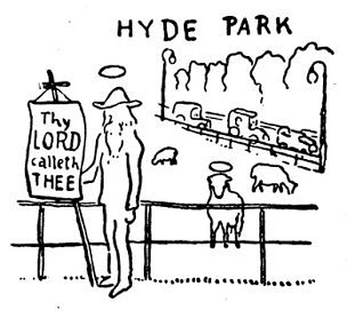  

Za mříží v Hyde Parku se pásly ovce; a když jsem se na ně díval, jedna, patrně nejstarší, vstala a začala bečet; i naslouchal jsem jejímu ovčímu kázání, a teprve když domluvila, šel jsem domů, spokojen a očištěn jako po bohoslužbě. Mohl bych na to navázat výtečné úvahy o demokracii, anglické povaze, potřebě víry a jiných věcech; ale raději nechávám celé události její přirozenou krásu.

### V Natural History Museum

</section>

<section>

„Byl jste v British Museum?“

„Viděl jste Wallace Collection?“

„Byl jste už v Tate Gallery?“

„Viděl jste Madame Tussauďs?“

„Prohlédl jste si South Kensington Museum?“

„Byl jste v National Gallery?“

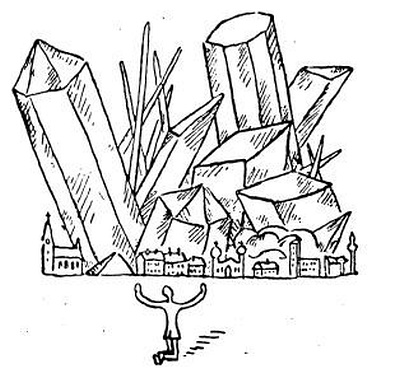  

Ano, ano, ano, byl jsem všude; ale nyní mi dovolte, abych si sedl a povídal o něčem jiném. Co jsem chtěl říci? Ano, divná a velká je příroda; a já, neúnavný poutník k obrazům a sochám, se přiznám, že mi největší rozkoš způsobily mušle a krystaly v Natural History Museum. Ovšem i mamuti a praještěři jsou velmi krásní; rovněž ryby, motýli, antilopy a jiná zvěř polní; ale nejhezčí jsou mušle a škeble, neboť vypadají, jako by si je pro zábavu tvořil duch božsky hravý a okouzlený nesčíslnými možnostmi. Jsou růžové, masité jako dívčí ústa, nachové, jantarové, perleťové a černé, bílé a skvrnité, těžké jako kovadlina a filigránské jako pudřenka královny Mab, točené, rýhované, ostnaté, oblé, podobné ledvinám, očím, rtům, šípům, přilbicím a ničemu na světě; průsvitné, opalizující, něžné, strašné a nepopsatelné. Co jsem chtěl říci? Ano, když jsem pak probíhal poklady a klenotnicemi umění, sbírkami nábytku, zbraní, šatů, koberců, řezeb, porculánu, věcí tepaných, rytých, tkaných, hnětených, kovaných, vykládaných a malovaných, polévaných a vyšívaných a pletených, viděl jsem znovu: divná a velká je příroda. To vše jsou jiné mušle, vypocené jinou božskou a nutnou hravostí; to vše vydal ze sebe plž nahý a měkký, třesoucí se tvořivým šílenstvím. Nádherná věcičko, netsuké Japanu či východní tkanino, kdybych tě mohl mít doma, čím bys mi byla! Lidským tajemstvím, projevem člověka, řečí cizí a spanilou. Ale v tomto strašlivém a nezměrném nahromadění už není jednotlivců, ani osobních rukou, ani dějin; jest jenom šílená příroda, živočišná tvořivost, fantastická hojnost krásných a podivných mušlí vylovených z oceánu bez času. I buďtež jako příroda; tvořte, tvořte věci podivné, krásné, rýhované či točené, pestré i průsvitné; čím hojněji, divněji a čistotněji budete tvořiti, budete bližší přírodě nebo snad Bohu. Veliká jest příroda.

Ale nesmím zapomenouti na krystaly, formy, zákony a barvy. Jsou krystaly veliké jako sloupoví chrámu, něžné jako plíseň a ostré jako jehličky; čiré, modré, zelené jako nic na světě, barev ohnivých nebo černé; matematické, dokonalé, podobné konstrukcím podivínských a pomatených učenců; nebo připomínající játra, srdce, obrovská pohlaví a živočišné hleny. Jsou krystalové jeskyně nebo obludné bubliny minerálního těsta; je nerostné kvašení, škvaření, růst, architektura i inženýrství; přisámbůh, gotický kostel není nejsložitější z krystalů. I trvá v nás síla krystalinická; i krystalizoval Egypt v pyramidách a jehlanech, Řecko ve sloupefch, gotika ve fiálách a Londýn v kostkách černého bláta; nesčíslné zákony stavby a skladby probíhají hmotou jako tajemné matematické blesky. Musíme být přesní, matematičtí a geometričtí, abychom byli rovni přírodě. Číslo a fantazie, zákon a hojnost jsou horečnými silami přírody; nikoliv sedět pod zeleným stromem, nýbrž tvořit krystaly a ideje znamená stávat se přírodou; tvořit zákony a formy; pronikat hmotu žhavými blesky božského počtářství.

Ach, jak málo výstřední, jak málo odvážná a přesná je poezie!

### Poutník probírá další muzea

</section>

<section>

Poklady celého světa shrnula bohatá Anglie ve svých sbírkách; sama nepříliš tvořivá, svezla metopy akropolské a egyptské kolosy z porfyru nebo žuly, reliéfní balvany asyrské, uzlovité plastiky starého Yucatánu, usměvavé Buddhy, řezbičky a laky japonské, výkvět umění z kontinentu a změť koloniálních památek: železná kování, tkaniny, skla, vázy, dózičky šňupáků, knižní vazby, sochy, obrazy, email, vykládané sekretáře, saracénské šavle a Bůh mi pomoz, já nevím co ještě; snad všecko, co na světě má nějakou cenu.

Měl bych být nyní zajisté velmi poučen o různých stylech a kulturách; měl bych něco povídat o vývojových etapách v umění; měl bych si v hlavě roztřídit a rozdělit všechen ten materiál, který tu je vystaven pro podiv a poučení. Avšak místo toho jsem roztrhl roucho své a ptám se: Kde je dokonalost člověka? Vždyť je to strašné, že je všude; vždyť je to příšerný objev, nalézt dokonalost člověka i na počátku bytí; nalézt ji v utváření prvního kamenného šípu; nalézt ji v kresbě křovákově; nalézt ji v Číně, na Fidži a ve starém Ninive a všude, kde člověk nechal památku svého tvořivého života. Viděl jsem tolik věcí, mohl bych volit; dobře, říkám vám tedy, že nevím, je-li člověk dokonalejší, vyšší a poutavější utvářeje první popelnici nebo vyzdobuje slavnou vázu portlandskou; nevím, je-li dokonalejší být člověkem jeskynním nebo Britem z West Endu; nevím, je-li vyšším a božštějším uměním malovati portrét královny Viktorie na plátně nebo portrét pingvína prsty ve vzduchu, jako činí domorodci Ohňové země. Říkám vám, je to strašné; strašný je relativismus času a prostoru, ale strašnější je relativismus kultury a dějin; nikde za námi ani před námi není bodu klidu, ideálu, hotovosti a dokonalosti člověka; neboť je všude a nikde, a každé místo v prostoru a v čase, kde člověk postavil své dílo, je nepřekročitelné. A já už ani nevím, je-li portrét od Rembrandta dokonalejší než taneční maska ze Zlatého pobřeží; viděl jsem příliš mnoho. I my se musíme vyrovnati Rembrandtovi nebo masce ze Zlatého či Slonového pobřeží; není pokroku, není „nahoru“ ani „dolů“; je jen nekonečně nová tvořivost. Toto je jediný příklad, který dávají dějiny, kultury, sbírky a poklady celého světa: tvořte jako diví, tvořte ustavičně; na tomto místě, v tomto okamžiku se má vytvořit vrchol a dokonalost lidského díla; musí se vystoupiti tak vysoko jako před padesáti tisíci lety nebo jako v gotické madoně nebo jako v tamté bouřlivé krajině Constablově. Je-li deset tisíc tradicí, není vůbec žádná tradice; nelze si něco vybrat z všehojnosti; lze k ní jen přidat něco nebývalého.

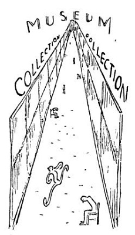  

Hledáte-li v londýnských sbírkách řezby ze sloni či vyšívané pytlíky na tabák, najdete je; hledáte-li dokonalost lidského díla, najdete ji v Indickém muzeu i galerii Babylonské, v Daumierech, Turnerech a Watteauech i mramorech Elginových. Ale pak vyjdete z tohoto nakupení všech pokladů světa a můžete jezdit hodiny a míle po střeše busu, od Ealingu po East Ham a od Claphamu až po Bethnal Green; a nenajdete skoro, kde by se vaše oko potěšilo krásou a bujností lidského díla. Umění je, co je uloženo za sklem v galeriích, muzeích a v pokojích bohatých lidí; ale neběhá tady po ulicích, nemrká pěknými římsami oken, nepostaví se na rohu jako pomník, nepozdraví tě řečí důvěrnou nebo monumentální. Já nevím: snad je to přece jen protestantismus, co umělecky vysálo tuto zemi.

### Poutník vidí zvířata a slavné lidi

</section>

<section>

Hanbil bych se, kdybych nebyl v zoo a v Kew Gardens; neboť máš znáti všecko. I viděl jsem koupat se slony a pardály vyhřívat hebká břicha ve večerním slunci, nakoukl jsem do strašlivé huby hrochovy, podobné obrovským hovězím plicím, divil jsem se žirafám, jež se usmívají útle a rezervovaně jako stárnoucí slečny, koukal jsem, jak spí lev, jak se pojímají opice a orangutan si dává na hlavu koš jako my lidé klobouk; indický páv pro mne rozevřel ocas a točil se hrabaje vyzývavě pařátem, ryby v akváriu zářily duhovými barvami a nosorožec zdál se vězet v kůži, která byla šita na hovado ještě větší. Dost už, až dost jsem toho vypočítal; už nechci nic víc vidět.

Avšak ježto jsem onehdy neuměl nakreslit zpaměti jelena, běžel jsem do Richmond Parku, kde jsou jich celá stáda. Blíží se bez okolků k lidem, dávajíce přednost vegetariánům. Ač trefit jelena je úkol dosti těžký, podařilo se mi nakreslit celé stádo. Za nimi prodléval v trávě párek milenců; nepojal jsem je do svého obrázku, neboť to, co dělali, dělávají u nás milenci také, jenomže ne tak veřejně.

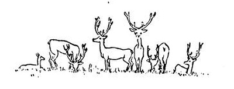  

Zaléval jsem se potem v tropických sklenících v Kew mezi palmami, liánami a vším, čím bují bláznivá země; byl jsem se podívat na vojáka, jenž v ohromné beranici a červeném kabátě běhá před Towerem a při každém obratu tak divně vám zadupe, jako když pes hrabe zadníma nohama v písku; nevím, k jaké historické události se vztahuje tento zvláštní zvyk. Byl jsem u Madame Tussauďs.

Madame Tussauďs je muzeum slavných lidí, totiž jejich voskových figur. Je tam královská rodina (také král Alfons, poněkud zachvácený od molů), Macdonaldovo ministerstvo, francouzští prezidenti, Dickens a Kipling, maršálové, slečna Lenglenová, vynikající vrahové z posledního století a památky po Napoleonovi, jako jeho ponožky, opasek a klobouk, dále je tam na místě hanby císař Vilém a František Josef, na svůj věk stále ještě svěže vypadající. U jedné zvláště podařené figuríny pána v cylindru jsem se zastavil a hledal jsem v katalogu, kdo to je; najednou se pán s cylindrem pohnul a odešel; bylo to příšerné. Za chvíli dvě slečny hledaly v katalogu, koho představuji já. U Madame Tussauďs jsem učinil poněkud nepříjemný poznatek; buď jsem zcela neschopen číst v lidských tvářích, nebo fyziognomie klamou. Tak například mne na první pohled zaujal sedící pán s kozí bradou, číslo 12; v katalogu jsem našel: „12. Thomas Neill Cream, popraven 1892. Otrávil strychninem Matildu Cloverovou. Byl také obviněn z vraždy tří jiných žen.“ Vskutku, jeho tvář je velmi podezřelá. Číslo 13, Franz Müller, zavraždil pana Briggse ve vlaku, hm. Číslo 20, oholený pán, vypadající téměř honetně: Arthur Devereux, popraven 1905, zvaný „kufrový vrah“, ježto ukrýval mrtvoly svých obětí po kufrech. Děsné. Číslo 21, – ne, tento ctihodný kněz nemůže být „paní Dyerová, readingská vražednice nemluvňat“. Shledávám, že jsem si spletl stránky katalogu, a jsem nucen opravit své dojmy; sedící pán číslo 12 je jenom Bernard Shaw, číslo 13 je Louis Blériot a číslo 20 je prostě Guglielmo Marconi.

Už nikdy nebudu posuzovat lidi podle tváří.

### Clubs

</section>

<section>

Jakpak to mám skromně říci? Nu ano, dostalo se mi té nezasloužené cti, že jsem byl uveden do některých z nejuzavřenějších klubů londýnských, což se každému pocestnému nestane; i pokusím se vylíčit, jak to tam vypadá. Jméno jednoho jsem zapomněl a nevím ani, ve které je ulici; ale vedli mne takovým středověkým průchodem, potom nalevo a napravo a ještě jinudy až k jednomu domu s dočista slepými okny, a pak dovnitř, bylo to jako kůlna, a odtud se šlo do sklepa a tam byl ten klub; byli tam boxeři a literáti a krásné dívky, dubové stoly a hliněná podlaha, místnost jako dlaň, díra fantastická a hrozná; myslel jsem, že mne tam zabijí, ale dali mi jíst na hliněných talířích a byli milí a hezcí; potom mne odvezl šampion jižní Afriky v běhu a skoku, a já podnes se pamatuji na hezkou dívku, která se tam ode mne učila česky.

  

Ten druhý klub je slavný, stoletý a nesmírně ctihodný; v něm sedával Dickens a Herbert Spencer a mnozí jiní, které mi tamní vrchní číšník, majordom či vrátný (nebo kdo to byl) vesměs jmenoval; snad je také všechny četl, neboť zdál se být velmi ušlechtilý a důstojný, jako bývají archiváři. Provedl mne celým tím historickým palácem; ukázal mi knihovnu, čítárnu, staré rytiny, vytápěné klozety, koupelny, jakési historické lenošky, sály, kde gentlemani kouří, jiné sály, kde píší a kouří, a jiné, kde kouří a čtou; všude vane dech slávy a starých kožených křesel. Jářku, kdybychom měli takové staré kožené židle, měli bychom také tradici; představte si, jaká by se zrodila historická kontinuita, kdyby si František Götz mohl sednout na židli po Zákrejsovi, Šrámek po Šmilovském a profesor Rádl, dejme tomu, po nebožtíku Hattalovi. Naše tradice není podložena tak starými a zejména tak komfortními lenoškami; jelikož nemá na čem sedět, visí ve vzduchu. Na to jsem myslel, když jsem se uvelebil v jedné z těch historických lenošek; bylo mně trochu dějinně, ale jinak docela pohodlně, a okukoval jsem historické osobnosti, které dílem visely na stěnách, dílem seděly v klubovkách a četly Punch[^1] nebo Who is Who. Nikdo nemluvil, což působí opravdu důstojně; měli bychom mít u nás taková místa, kde se mlčí. Starý pán se šourá o dvou holích sálem, a nikdo mu zlomyslně neřekne, že výborně vypadá; jiný se hrabe v novinách (nevidím mu do tváře), aniž by pocítil náruživou potřebu mluvit s někým o politice. Člověk z pevniny si dodává důležitosti tím, že povídá; Angličan tím, že mlčí. Zdálo se mi, že všichni, kdo tam jsou, jsou Členové Královské Akademie, slavní mrtví nebo bývalí ministři, neboť nikdo z nich nemluvil; nikdo se na mne nepodíval, když jsem přišel, a nikdo, když jsem odešel. Chtěl jsem být jako oni, ale nevěděl jsem kam s očima; když nemluvím, dívám se, a když se nedívám, myslím na divné nebo šprýmovné věci; i stalo se mi, že jsem se nahlas zasmál. Nikdo se po mně neohlédl; bylo to drtivé. Pochopil jsem, že se koná jakýsi obřad, k němuž patří kouření z lulky, listování ve Who is Who a zejména mlčení. Toto mlčení není mlčení člověka o samotě, ani mlčení pythagorejského filozofa, ani mlčení před Bohem, ani mlčení smrti, ani němé hloubání; je to mlčení zvláštní, společenské a vytříbené, mlčení gentlemana mezi gentlemany.

Přišel jsem ještě do jiných klubů; je jich tu mnoho set, různého chlupu a poslání, ale ty lepší jsou vesměs na Piccadilly nebo v sousedství a mají staré kožené lenošky, obřad mlčení, dokonalé sklepníky a klauzuru vůči ženským; jak vidíte, jsou to veliké přednosti. Mimoto jsou stavěny v klasickém slohu z kamene, který je černý kouřem a bílý deštěm; uvnitř je dobrá kuchyně, ohromné sály, ticho, tradice, teplá a studená voda, nějaké portréty a kulečníky a mnoho jiných památných věcí. Jsou také politické kluby a ženské kluby a noční kluby, ale tam jsem nebyl.

Na toto místo by se hodilo rozjímání o společenském životě, mužském řeholnictví, dobré kuchyni, starých podobiznách, anglické povaze a některých jiných otázkách s tím souvisejících, ale jakožto člověk pocestný musím se ubírat dále, k novým a novým poznatkům.

  

### Největší vzorkový veletrh  
čili British Empire Exhibition

#### I.

</section>

<section>

Mám-li vám hned předem říci, čeho je nejvíc na výstavě ve Wembley, tedy rozhodně lidí; a školních výprav. Jsem sice přítelem populace, pohlavního rozmnožování, dětí, škol a názorné výchovy, ale přiznám se, že chvílemi jsem si přál mít s sebou strojní pušku, abych si proklestil cestu splašeným, tlačícím se, běžícím, dupajícím stádem kluků s kulatými čepičkami na kokosech nebo řetězem holek, jež se drží za ruce, aby se neztratily. Časem se mi s nekonečnou trpělivostí povedlo dostat se až ke stánku; prodávala se tam novozélandská jablka nebo tam byla vystavena rýžová košťata z Austrálie či kulečník vyrobený na Bermudách; poštěstilo se mi dokonce spatřit sochu prince z Walesu udělanou z kanadského másla, což mne naplnilo lítostí, proč většina londýnských pomníků není také vyrobena z másla. Načež opět jsem byl posunován proudem lidí, oddávaje se výhledu na krk tlustého gentlemana nebo na ucho staré dámy přede mnou. Ostatně jsem nic nenamítal; co lidí by se tlačilo, kdyby v oddělení australských chladíren byly vystaveny ruměné krky tlustých gentlemanů nebo v hliněném paláci Nigérie koše se sušenýma ušima starých dam.

Bezmocně se vzdávám úmyslu podat ilustrovaného průvodce výstavou ve Wembley. Jak mám vylíčit tento roh komerciální hojnosti? Jsou tam vycpané ovce, sušené švestky, klubovky vyrobené na Fidži, hory damaru[^2] nebo cínové rudy, girlandy skopových kýt, sušená kopra podobná ohromným kuřím okům, pyramidy konzerv, gumová stínítka, staroanglický nábytek z jihoafrických továren, syrské hrozinky, cukrová třtina, hole a sýr. A novozélandské kartáče, cukroví z Hongkongu, nějaké malajské oleje, australské voňavky, model jakýchsi cínových dolů, gramofony z Jamaiky a pohoří másla z Kanady. Jak vidíte, je to cesta kolem světa, nebo spíše putování příliš velikým bazarem. Jakživ jsem nebyl v tak gigantickém jarmarku.

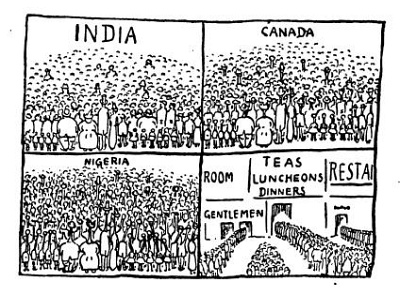  

Krásný je palác strojnictví; a nejkrásnější díla britského výtvarného umění jsou lokomotivy, lodi, kotle, turbíny, transformátory, takové divné mašiny se dvěma rohy na čele, stroje na všeliké točení, třesení a bouchání, obludy daleko fantastičtější a nekonečně elegantnější než praještěři v Natural History Museum; nevím, jak se jmenují a co se s nimi dělá, ale je to krásné, a někdy pouhá šroubová matička (sto liber těžká) je vrchol formální dokonalosti. Některé stroje jsou červené jako paprika, jiné masivní a šedé, některé žíhané mosazí a jiné černé a velkolepé jako náhrobek; a je to divné, že věk, který vymyslil dva sloupy a sedm stupňů před každým domkem, vybásnil v kovu takovou nevyčerpatelnou podivnost i krásu forem a funkcí. A nyní si představte, že toho je natěsnáno na ploše větší než Václavské náměstí, že je to větší než Uffizie a Vatikánské sbírky dohromady, že se to většinou točí, syčí, mele naolejovanými šoupátky, cvaká ocelovými čelistmi, tučně se potí a leskne mosazí; je to mýtus kovového věku. Jediná dokonalost, které moderní civilizace dosahuje, je mechanická; stroje jsou nádherné a bezvadné, ale život, který jim slouží nebo je jimi obsluhován, není nádherný, ani lesklý, ani dokonalejší, ani sličnější; ani dílo strojů není dokonalé, jen Ony, Stroje, jsou jako bohové. A abyste věděli, našel jsem skutečnou modlu v Paláci průmyslu. Je to kroužící nedobytná pokladna, lesklá pancéřová koule, která se tiše točí a točí na černém oltáři. Je to divné a trochu příšerné.

Odnes mne domů, Letící Skote, skvělá stopadesátitunová lokomotivo, přenes mne přes moře, lodi bílá a svítící; sednu si tam na drsné mezi mateřídouškové a zavru oči, neboť jsem selské krve a trochu mne znepokojilo, co jsem viděl. Tato dokonalost hmoty, z níž neplyne dokonalost člověka, tyto skvoucí nástroje těžkého a nevykoupeného života mne matou. Jak by vypadal vedle tebe, Letící Skote, slepý žebrák, který mi dnes prodal sirky? Byl slepý a sžírán prašivinou; byl to velmi špatný a porouchaný stroj; byl to právě jenom člověk.

#### II.

</section>

<section>

Kromě strojů předvádí výstava ve Wembley dvojí podívanou: suroviny a produkty. Suroviny jsou obyčejně krásnější a zajímavější. Cihla čistého cínu má něco dokonalejšího než rytá a tepaná cínová mísa; ryšavé nebo ohnivě šedé dříví někde z Guayany nebo Sarawaku je rozhodně poutavější než hotový biliár a slizce průsvitná surová guma z Ceylonu či Malajska je vlastně daleko krásnější a tajuplnější než gumové koberce nebo gumový biftek; a to vám ještě nepopisuji všeliké africké zrní, ořechy bůhví odkud, bobule, semena, jádra, plody, pecky, šáchory, klasy, makovice, hlízy, lusky, dřeně a vlákna a kořeny a listí, věci sušené, moučné, olejnaté a lupenité ve všech barvách a hmatatelných jakostech, jejichž jména, většinou velmi krásná, jsem zapomněl a jichž užití je mi poněkud záhadné; myslím, že se tím posléze mažou stroje, imituje mouka nebo mastí podezřelé tarts v Lyonsových požíracích velkoústavech. Z těch žhavých, žíhaných, brunátných, temných a kovově znějících dřev se ovšem dělá staroanglický nábytek, a nikoliv negerské modly, ani chrámy, ani trůny černých či hnědých králů. Nanejvýš ještě lýkové koše či pytle, ve kterých sem bylo svezeno toto bohatství obchodních artiklů Britského impéria, povídají něco o negerské nebo malajské ruce, která se do nich vepsala svým podivným a pěkným technickým rukopisem. Vše ostatní je evropský produkt. Ale abych nelhal: ne všechno ostatní. Je několik uznaných exotických průmyslů, jako například indická velkovýroba Buddhů, čínské vějíře, kašmírské šály nebo damascenské meče, ve kterých si Evropané libují. A tedy se vyrábějí ve velkém sedící Sakiamunové, anilínové laky, exportní čínský porculán, sloni ze slonoviny a kalamáře z hadince nebo mastku, ryté mísy, perleťové hlouposti a jiné zaručeně pravé exotické výrobky. Není už lidového domorodého umění; černoch v Beninu vyřezává ze sloních klů figurky, jako by vychodil mnichovskou akademii, a dáte-li mu kus dřeva, vyřeže z něho klubovku. Inu Bože, patrně přestal být divochem a stal se – čím vlastně? ano, stal se zaměstnancem civilizovaného průmyslu.

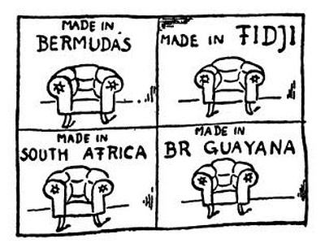  

Čtyři sta milionů barevných lidí je v Britské říši; a na výstavě Britské říše je z nich vidět jen několik reklamních panáků, pár žlutých nebo hnědých kramářů a několik starých památek, jež se sem dostaly jaksi pro kuriozitu a pro zábavu. A já nevím, je-li to strašný úpadek barevných ras nebo strašné mlčení čtyř set milionů; a nevím ani, co z toho dvojího by bylo hroznější. Výstava Britského impéria je ohromná a přeplněná; je tu všecko, i vycpaný lev a vyhynulý emu; schází tu jen duch čtyř set milionů lidí. Je to výstava anglického obchodu. Je to průřez té slaboučké vrstvy evropských interesů, které povlékly celý svět, nestarajíce se příliš o to, co je vespod. Výstava ve Wembley ukazuje, co čtyři sta milionů lidí dělá pro Evropu, a zčásti také, co Evropa dělá pro ně; ale není tu to, co oni sami dělají pro sebe. Není toho mnoho ani v Britském muzeu; největší koloniální říše nemá skutečného etnografického muzea…

Avšak odstupte ode mne, špatné myšlenky; ať jsem raději posunován a postrkován proudem lidí od zélandských jablíček ke guinejským kokosům, od singaporského cínu k zlatým rudám jižní Afriky; ať vidím dálky a zeměpásy, horniny a plodiny země, památky zvířat i lidí, všecko to, z čeho se nakonec lisují šustící librové bankovky. Je tu všecko, co lze zpeněžit, kupovat a prodávat, od hrsti zrní po salónní vagon, od kusu uhlí po kožišinu z modrých lišek. Duše má, co by sis chtěla koupit z těchto pokladů světa? Nic, nic vlastně; chtěla bych být maličká a stát zase v krámě starého Prouzy v Úpici, vyvalovat oči na černý perník, pepř, zázvor, vanilku a bobkové listí a myslet si, to že jsou všechny poklady světa a všechny vůně Arábie a všechno koření dalekých zemí, žasnout, čichat a pak si běžet číst Verneův román o končinách divných, dalekých a vzácných.

Neboť já, hloupá duše, jsem si je představovala jinak.

### East End

</section>

<section>

Začíná se to nedaleko za středem světa, za Anglickou bankou, Burzou a džunglí ostatních bank a směnáren; toto Zlaté pobřeží je téměř omýváno černými vlnami Východního Londýna. „Nechoďte tam bez průvodce,“ říkali mi domorodci z West Endu, „a neberte s sebou mnoho peněz.“ Nuže, je to rozhodně přehnáno; podle mého vkusu je Piccadilly nebo Fleet Street horší divočina než Psí Ostrov nebo zlopověstný Limehouse i s Čínským Městem a než celý Poplar se vším všudy, s židy, s plavci i s bídným Rotherhithe na druhé straně řeky. Nestalo se mi nic, vrátil jsem se jen hodně smuten, ač jsem obstál na razii v Košířích i v přístavních ohavnostech Marseille či Palerma. Pravda, jsou to velmi ošklivé ulice z blátivých cihel, se spoustou dětí na dlažbě, divnými čínskými typy, jež běhají jako stíny po obchodech ještě divnějších, opilými námořníky, dobročinnými azyly, krvavými výrostky a přiškvařeným, hadrovým zápachem; ale viděl jsem horší místa, bídu řvoucí, špinavou a zanícenou jako vřed, nevýslovné zápachy a doupata hroznější než vlčí pelech. Ale to není to, to není to. Strašné ve Východním Londýně není to, co lze vidět a čichat, ale to, že toho je tak nesmírně a nevykupitelně mnoho. Jinde je chudoba a ošklivost jen jako smetiště mezi dvěma domy, jako ohavný kout, píštěl či nečistý odpadek; ale tady jsou míle a míle černých domků, beznadějných ulic, židovských krámů, nadpočetných dětí, kořalen a křesťanských azylů. Míle a míle, od Peckhamu po Hackney, od Walworthu po Barking: Bermondsey, Rotherhithe, Poplar, Bromley, Stepney Bow a Bethnal Green, čtvrti dělníků, židů, cockneyů a nakladačů z doků, lidí chudých i ztracených – vše stejně nijaké, černé, holé a nekonečné, proryté nečistými kanály hlučné komunikace a napořád stejně bezútěšné. A na jihu, na severozápadě, na severovýchodě zase totéž, míle a míle černých domků, kde celá ulice je jen nesmírný horizontální činžák, továrny, plynojemy, trati, hlinité občiny, sklady hmot a sklady lidí, bez konce a bez naděje. Jsou jistě ohavnější čtvrti a bídnější ulice ve všech dílech světa; i bída má zde vyšší úroveň, a nejchudší žebrák nevězí ještě v hadrech; ale můj Bože, co lidí, jaké miliony lidí žijí v této větší polovině Londýna, v těchto krátkých, uniformních, neradostných ulicích, jež se hemží na plánu Londýna jako červi v nesmírné mršině!

A to právě je smutek East Endu: je toho příliš mnoho; a nedá se to předělat. Ani démon pokušitel by si netroufal říci: Chceš-li, zbořím toto město a ve třech dnech je znovu postavím, – znovu a lépe; ne tak černě, ne tak mechanicky, ne tak nelidsky a pustě. Kdyby to řekl, snad bych padna se mu klaněl. Běhal jsem ulicemi, jejichž jména připomínají Jamaiku, Kanton, Indii nebo Peking; všecky jsou stejné, ve všech oknech záclonky; mohlo by se to zdát skoro slušné, kdyby nebylo pět set tisíc takových ubikací. V této zdrcující kvantitě už to nevypadá jako příbytek lidí, nýbrž jako geologický útvar; toto černé magma je chrleno továrnami; nebo je to sedlina obchodu, jenž tamhle po Temži pluje na bílých lodích; nebo se to navrstvilo sazemi a prachem. Běžte se podívat na Oxford Street a Regent Street a Strand, jak krásné domy postavili lidé pro zboží, pro výrobky, pro věci; neboť výrobek člověka má svou cenu. Košile by ztratila na ceně, kdyby měla být prodávána v takovýchto šedivých a jalových stěnách; ale člověk tu může žít, to jest spát, jíst ošklivá jídla a plodit děti.

  

Snad by vás někdo znalejší zavedl na místa malebnější, kde i špína je romantická a bída pitoreskní; ale já jsem zabloudil do uliček velkého počtu a nemohu najít cestu ven. Nebo je vůbec jisto, kam vedou tyto nesčíslné černé ulice?

### Country

</section>

<section>

Nuže, sedni na vlak a ujížděj některým směrem, zpívaje si do rachotu kol „kudy ven, kudy ven“. I defilují ulice Velkého Počtu, bubny plynáren, křižovatky kolejí, továrny, hřbitovy; nyní vpadají pásy zeleně do nekonečného města, vidíš poslední stanice tramvají, tichá předměstí, zelenou trávu a první ovečky skloněné k zemi ve věčném přírodním obřadu žraní. A pak ještě půl hodiny, a jsi venku z největšího města na světě; vystoupíš na některé staničce, kde tě čekají pohostinní lidé, a jsi v anglické country.

  

Kde si nyní nabereš pěkných slov, abys vylíčil tiché a zelené půvaby anglického venkova? Byl jsem dole v Surrey a nahoře v Essexu; běhal jsem po cestách vroubených živými ploty, samými živými ploty, které dělají z Anglie tu pravou Anglii, neboť ohraničují, ale netísní; pootevřená vrátka tě vedou do staleté aleje parku hlubšího nežli les, a tady je červený domek s vysokými komíny, věž kostela mezi stromy, luka se stády krav, stáda koní, jež po tobě obracejí krásné a vážné oči; cestička jako by ji vymetl, sametové tůně s lekníny a kosatci, parky, zámky, louky a louky, žádná pole, nic, co by křičelo o lidské dřině; ráj, kde sám Pán Bůh udělal asfaltové a pískové cesty, nasázel staré stromy a upletl z břečťanu dečky na červené domky. Můj strýče, český sedláku, jak byste potřásl v nevoli hlavou, dívaje se na červená a černá stáda krav na nejkrásnějších lukách světa, a řekl byste: Jaká škoda toho krásného hnoje! A řekl byste: Proč tadyhle nenasázejí řepy, a tuhle, lidi, tuhle by mohla být pšenka, a tady brambory, a tady bych nasázel místo toho křoví třešně a vajksle; a tady vojtěšku, a tuhle ovísek, a tady na tom lánu žito nebo řepku; vždyť je tu hlína, lidi, že by ji mohl na chleba mazat, a oni to nechají na pastvu! – Víte, strýčku, ono to prý tady nestojí za tu práci; abyste věděl, pšenka sem chodí z Austrálie a cukr z Indie a brambory z Afriky nebo odkud; víte, strýčku, tady už nejsou sedláci; a tohle je jen taková zahrada. – A víš, hochu, řekl byste, to se mně u nás líbí víc; je to třeba jen řepa, ale člověk aspoň vidí tu práci. A tady, vždyť tu ani nikdo nehlídá u těch krav a voveček; že jim je nikdo neukradne! Namoutě, hochu, vždyť tu není vidět človíčka; jen tamhle jede někdo na kole, a tady, kuš, zas někdo na tom smradlavém autě; hochu, hochu, copak tu nikdo nic nerobí?

Těžko bych vyložil svému strýčkovi hospodářskou soustavu Anglie; příliš by ho svrběly dlaně po těžké radlici. Anglický venkov není pro práci; je pro oči. Je zelený jako park a nedotčený jako ráj; i putoval jsem travnatou stezkou v Surrey za vlahého deště, mezi trsy žlutě rozkvetlé kručinky a ryšavým vřesem, jenž prokvétal světlounkým kapradím; a nebylo tam nic než nebe a oblé kopečky, neboť domky i s lidmi jsou schovány v stromoví, odkud veselým obláčkem dýmá připravený oběd. Vzpomínám na tebe, dobrý starý domku se stropem z trámů a ohromným krbem, ve kterém se může uvelebit celý promoklý člověk; stůl je dubový a dobře chutná guildfordské pivo z hliněných džbánků a řeč veselých lidí nad anglickým špekem a sýrem. Ještě jednou vám děkuju, a musím zase dál.

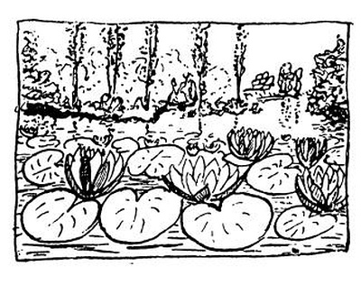  

Putoval jsem jako víla po trávnících v Essexu, lezl přes plot do panského parku a viděl lekníny a gladstonie na černé tůni, tancoval v sýpce tanec, který jsem neuměl, lezl na věž kostela a dvacetkráte za den žasl nad harmonií a dokonalostí života, jímž se obklopuje Angličan ve svém domově. Anglický domov, to je tenis a teplá voda, gong svolávající k obědu, knihy, louky, pohodlí vybrané, ustálené a požehnané staletími, svoboda dětí a patriarchálnost rodičů, pohostinnost a formalismus pohodlný jako župan; zkrátka anglický domov je anglický domov, a proto jsem jej na památku nakreslil i s kukačkou a králíkem; uvnitř pak žije a píše jeden z nejrozumnějších lidí tohoto světa a venku kukačka kuká třeba třicetkrát za sebou; tím končím pohádku o nejlepších věcech Anglie.

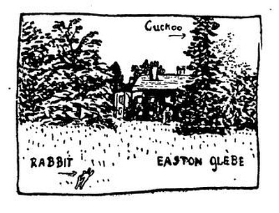  

### Cambridge a Oxford

</section>

<section>

Nejdříve má člověk dojem provinciálního města; a náhle, propána, čí je tenhle starý zámek? To je studentská kolej s třemi dvory, vlastní kaplí, královskou síní, kde jedí studenti, parkem, hřišti a já nevím čím ještě. A tady je druhá, ještě větší, se čtyřmi dvory, parkem za řekou, vlastní katedrálou, ještě větší gotickou jídelnou, pětisetletým trámovím, galerií starých portrétů, ještě staršími tradicemi a ještě slavnějšími jmény. Třetí pak je nejstarší, čtvrtá se vyznamenává vědami, pátá atletickými rekordy, šestá nejpěknější kaplí, sedmá nevím už čím, a protože jich je přinejmenším patnáct, spletl jsem si je všechny; vidím jen hradovité paláce perpendikulárního slohu[^3], ohromná nádvoří, kde běhají páni žáci v černých talárech a čtverhranných baretech s třapečkem, z nichž každý má své dva nebo tři pokoje v těchto zámeckých křídlech; vidím gotické kaple vykuchané protestantismem, hodovní síně s estrádou pro masters a fellows, ctihodné uzené portréty earlů, státníků a poetů, kteří odtud vyšli, vidím proslulé backs, totiž zadky kolejí nad říčkou Cam, přes niž jsou hozeny mosty do staletých kolejních parků; pluji po něžné říčce mezi backs a parky a myslím na naše studenty, na jejich hubená břicha a boty prošoupané běháním po přednáškách. Klaním se ti po pás, Cambridgi, neboť dostalo se mi cti jíst na estrádě mezi učenými masters v síni tak ohromné a staré, že mi bylo, jako by se mi to jen zdálo; zdravím tě oběma rukama, Cambridgi, neboť dostalo se mi radosti jíst se studenty, masters a jinou mládeží z hliněných hrníčků v Půlměsíci; a bylo mi dobře mezi nimi.

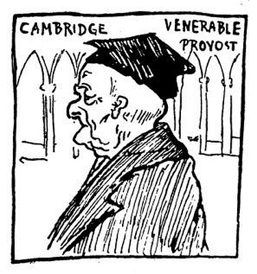  

A viděl jsem trávníky, na které smí vstoupit jen master, a nikoliv undergraduate, a schody, na kterých smí hrát v kuličky jen graduate, a nikoliv student; viděl jsem profesory v králičině a pláštích červených jako langusta, viděl jsem, jak graduovaní klekají a líbají ruku místokancléřovu; z těch všech divů jsem mohl nakreslit jen jednoho ctihodného kolejního probošta, jenž mi nalil skleničku sherry aspoň tak starého jako starý Pitt.

  

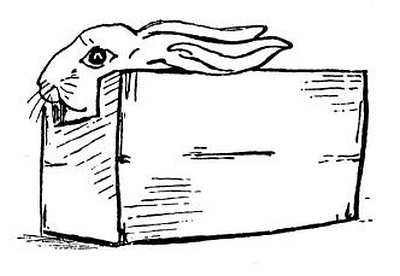  

Zpaměti jsem pak nakreslil koleje cambridgeské, jak se mi o nich několikrát zdálo; ve skutečnosti jsou ještě větší a krásnější.

Někdy se mi také zdává o cambridgeském králíkovi. Dali mu tam dýchat nějaký plyn, aby se podívali, co tomu říká jeho králičí slezina; viděl jsem ho umírat, dýchal překotně a poulil oči. Nyní mne strašívá ve snách; buď Bůh milostiv jeho ušaté duši.

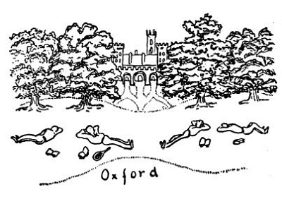  

Co mám nyní říci špatného o Oxfordě? Nemohu chválit Oxford, chvále Cambridge; a mé přátelství s Cambridgí mne zavazuje, abych dštil síru a oheň na hrdopyšný Oxford. Bohužel se mi tam docela líbilo; koleje tam jsou ještě větší a snad ještě starší, mají krásné tiché parky, galerie předků stejně slavných, hodovní síně, památky a důstojné pedely; ale veškerá tato paráda a tradice není pro každého; zdá se, že jejím účelem není pěstit učené odborníky, nýbrž pány. Představte si, že by naši studenti obědvali přinejmenším ve Valdštýnském sále na těžkém starém stříbře, obsluhováni číšníky v livrejích, zpracováváni ke zkouškám domácími profesory v posluchárnách vybavených všemi druhy klubovek, křesel a lehátek; představte si – Ale ne; hoši, nic si z toho nedělejte.

### Poutník navštěvuje katedrály

</section>

<section>

Katedrálová města jsou malá města s velkými katedrálami, ve kterých se konají nesmírně dlouhé bohoslužby; i přijde kostelník a nařídí turistovi, aby nekoukal na strop a pilíře, nýbrž sedl si do lavice a poslouchal, co tam v chóru odzpěvují. Tento zvyk mají kostelníci v Ely, Lincolnu, Yorku a Durhamu; nevím, co dělají jinde, neboť jinde jsem nebyl. Slyšel jsem ohromné množství litanií, žalmů, anthem[^4] a písní a všiml jsem si, že anglické katedrály mají obyčejně dřevěné stropy, následkem čehož není u nich vyvinut opěrný systém kontinentální gotiky; že perpendikulární pilíře v Anglii mají vzhled složitého potrubí; že protestantští kostelníci jsou tvrdší než katoličtí a potrpí si stejně na spropitné jako kostelníci italští, jenže jsouce gentlemany – musejí dostat větší; že reformace vykonala velmi prasácké dílo, když zurážela hlavy soch a odstranila z kostelů obrazy a jiné pohanské modlářství. Následkem toho jsou anglické katedrály holé a divné, jako by se do nich nikdo nenastěhoval. A ještě horší je, že uprostřed hlavní lodi je uzavřený chór pro kněze, ministranty a elitu farnosti; ostatní lid sedí dole a nevidí nic než víceméně vyřezávané stěny chóru a zadek varhan; hlavní loď je tím důkladně porušena, celkový prostor je rozříznut vedví; jakživ jsem neviděl něco tak absurdního. Ale protože tam v chóru ještě pořád něco zpívají, je nutno se sebrat a jít ven.

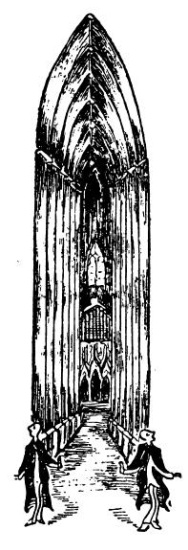  

Ely, Ely, lama sabachtani[^5]! Zradilo jsi mne, Ely, mrtvé město ležící u nohou románské katedrály, když unaven a žízniv jsem o páté hodině odpoledne tloukl na dveře čajoven a hospod, výčepů, trafik i papírníků, ale nebylo mi otevřeno. V pět hodin odpoledne Ely spí; neměl jsem bohužel pokdy vyzkoumat, co dělá Ely ve tři hodiny odpoledne nebo v deset hodin ráno; snad vůbec spí. I sedl jsem si mezi kravince ve veřejném parku a díval jsem se na ctihodnou katedrálu, která tu stojí k chvále Boží. Ty kavky kolem věží jsou snad duše kostelníků, kteří zaživa strašili v kostele.

Lincoln běží do kopečka, má hrádek a katedrálu a něco po Římanech, zapomněl jsem už co; katedrála je šerá a krásná a zpívají tam nějaké bohoslužby pro tři kostelníky, kteří mne nevraživě hlídají. Co mohu činit? Sbohem, kostelníci, jedu se podívat do Yorku.

V Yorku je katedrála ještě krásnější; chci si ji prohlédnout, ale kostelník povídá, abych toho jako nechal, že za chvíli budou bohoslužby. I šel jsem se projít na hradby a nakreslil jsem si odtamtud yorkský minster, třebaže se v něm konaly bohoslužby; snad proto přijdu do anglického pekla. Kolem je pěkný Yorkshire, krajina těžkých krav a slavných prasat, středisko všech anglických šunek a špeků; a ulice v Yorku jsou staré a hezké, s vysunutými štíty a černými trámy. Mnoho bych mohl říci o dějinách Yorku, ale musím jet do Durhamu.

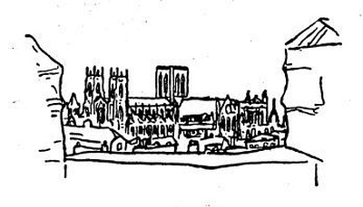  

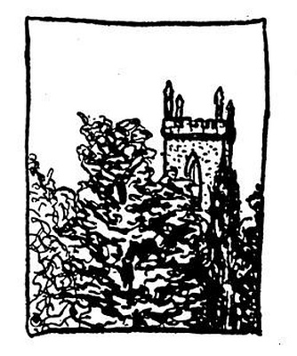  

Katedrála v Durhamu je prastará a strmí na vysoké skále; uvnitř se konají bohoslužby s kázáním, zpěvem a kostelníky; přece však jsem viděl hrob Bedy Ctihodného, zavalité pilíře a křížové chodby a výpravu hezkých Američanek; ty pilíře jsou pokryty hluboko vtesaným rýhováním, což působí zvláštním, skoro polychromatickým dojmem. Mimoto je tam hrob svatého Cuthberta, starý hrad a staré kamenné domky, a pěkné městečko běží z kopce na kopec, a víc už o tom nevím.

Tedy anglická chrámová architektura je úhrnem méně malebná i méně plastická než kontinentální. Když se jednou přednormanským Britům povedlo postavit náramné chrámové lodi s dřevěným stropem, zůstali na tom i v gotice, patrně z pravěké konzervativnosti; i jsou jejich kostely převeliké síně s širokými okny, bez klenby a žebroví, bez mocně vysunutého systému opěrných pilířů, oblouků, fiál a celé té plastické frenezie; a mají dvě čtyřhranné věže v portále a jednu nad zkřížením, sochy vymetené reformací a chudou sochařskou výzdobu, vnitřní prostor pokažený chórem a varhanami a celkový dojem silně otřesený přítomností kostelníků.

Avšak ještě slovíčko o vás, malé kostýlky bez chórů a kostelníků, holé a chladné síňky Boží s dubovým stropem, hřbitovním trávníkem dokola a čtyřhrannou věží mezi stromy, jež je tak typická pro anglický venkov jako báně cibulky pro náš venkov; věže, jež odbíjíte hodiny věčně stejným církevním nápěvem nad věčně stejnými náhrobky nebožtíků.

</section>

[^1]: Punch – tehdejší humoristický časopis. _Pozn. red._

[^2]: Damara – pryskyřice z damaroně nebo jiných asijských stromů. _Pozn. red._

[^3]: Svislý, kolmý; zde označení slohu z doby pozdní angl. gotiky. _Pozn. red._

[^4]: Chrámová skladba, kantáta. _Pozn. red._

[^5]: Eli, Eli, lama sabachtani! – parafráze posledních slov utrpení Ježíše Krista (Bože můj, proč jsi mě opustil!) _Pozn. red._

[^6]: Wynds nebo closes (skot. dialekt) – úzké cesty k domkům ve starém Edinburghu. _Pozn. red._

[^7]: Gleny – horské rokle, úžlabiny. _Pozn. red._

[^8]: Terra hyberborea – podle starověké představy Země blaha. _Pozn. red._

[^9]: Vyhlídkové otevřené autokary. _Pozn. red._

[^10]: Z franc. clavecin – cembalo, starý klávesový hudební nástroj. _Pozn. red._

[^11]: Smetanový vaječný krém. _Pozn. red._

[^12]: Ostrovní. _Pozn. red._
