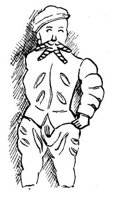
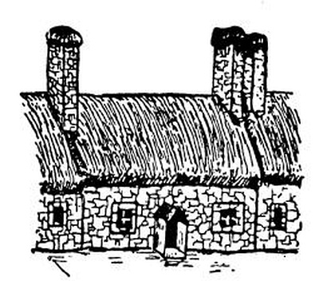
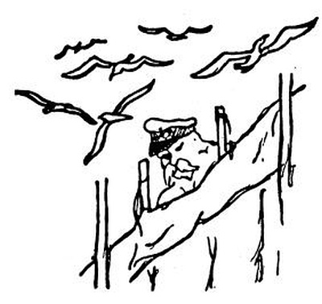

<section>

### Edinburgh

</section>

<section>

A nyní na sever, na sever! Ubíhá hrabství za hrabstvím, v některém krávy leží, v některém stojí, někde se pasou ovce, jinde koně a jinde jenom vrány. Zjeví se šedé moře, skály a mokřiny, přestávají živé ploty a místo nich táhnou se kamenné zídky. Kamenné zídky, kamenné vsi, kamenná města; za řekou Tweed je kamenná země.

  

Mr. Bone měl bezmála pravdu, když prohlásil Edinburgh za nejpěknější město na světě. Je pěkné, kamenně šedé a divné; tam, kde jinde teče řeka, běží železnice, na jedné straně je staré město, na druhé straně nové, třídy široké jako nikde, v každém průhledu socha nebo kostel; a ve starém městě hrozně vysoké domy, což není nikde v Anglii, a prádlo na bidélkách plápolající nad ulicemi jako vlajky všech národů, to také dole v Anglii není, a umazané, ryšavé děti na ulicích, to také dole v Anglii není; a kováři, truhláři i všelijací strejci, to také v Anglii není, a divné uličky, wynds nebo closes[^6], to také v Anglii není, a tlusté rozcuchané babky, to také v Anglii není; tady se zase začíná lid, jako v Neapoli nebo jako u nás. To vám je zvláštní, tady ty staré domy mají komíny v průčelí, jaksi místo věží, jak jsem to nakreslil. To není nikde na světě než v Edinburku. A město leží na kopcích; běžíš někam, a najednou máš pod nohama hlubokou zelenou propast s pěknou řekou dole; jdeš, a zničeho nic běží ti nad hlavou jiná ulice po mostě, jako v Janově; jdeš a přijdeš na čistě kruhové náměstí, jako v Paříži. Pořád se máš čemu divit. Vlezeš do Parlamentu a tam běhají celá hejna advokátů v paručkách se dvěma ocásky vzadu, jako před nějakými sty léty. Běžíš se podívati na hrad, co tak malebně stojí na kolmé skále, a přijde ti do cesty celá kapela dudáků a kumpanie highlanderů; ti mají nohavice z kostkovaných plédů a čepici s pentličkami, ale dudáci mají sukénky červené a černé a na nich takové pytlíky z koziny a hudou na dudách mečivou a rozčilující píseň za doprovodu celé kapely bubeníků. Paličky lítají nad hlavami bubeníků, točí se, vyskakují v divném a divošském tanci; a dudáci mečí válečnou píseň a pochodují po hradní esplanádě s nahými koleny drobnými krůčky baletek. A bum a bum, paličky se točí rychleji, kříží se, vzlétají, a najednou je z toho smuteční pochod, dudáci piští nekonečnou a táhlou melodii, highlandři stojí v pozoru, za nimi hrad skotských králů a ještě dále za nimi celé krvavé a strašné dějiny této země. A bum a bum, paličky tančí nad hlavami divoký a umný tanec – tady ještě hudba zůstala podívanou jako v pravěku; a dudáci se nadnášejí, jako by v hřebčí netrpělivosti tančili do boje.

  

Jiná země a jiní lidé. Je to provincie, ale monumentální; země chudší, ale křepká; brunátný a hranatý typ lidí, ale děvčata hezčí než dole v Anglii, krásné usmrkané děti, život rozložitý a chlapský přes všechen kalvinismus. Namouduši, tady se mi dobře zalíbilo; i dám vám ještě z radosti jako příseček kousek moře u Leith a Newhaven, moře studeného a ocelového, a modré škeble na památku a pozdrav rybářských bárek; a ještě vám přidám celé starobylé a malebné městečko Stirling s hradem skotských králů; stojíte-li u starého kanonu na výspě hradu, máte v rukou klíč ke skotským horám; což abychom se tam podívali?

Před hradem běhá baletka s bodákem a v kostkovaném kiltu; deset kroků k bráně, deset zpátky, pozor, paráda, k noze zbraň; baletka potřese sukénkou a tančí nazpátek. Na jihu bojiště Roberta Brucea, na severu modré hory; a dole na zelené louce se kroutí řeka Forth, tak jako se nekroutí žádná řeka na světě; i nakreslil jsem ji, aby každý viděl, že je to řeka krásná a potěšující.

  

### Loch Tay

</section>

<section>

Kdybych byl básníkem jako Karel Toman nebo Otakar Fischer, napsal bych dnes básničku ne dlouhou, ale krásnou. Byla by o skotských jezerech, byla by prováta skotským větrem a orosena každodenním skotským deštěm; bylo by tam něco o modrých vlnách, vřesu, kapradí a dumavých cestách; neřekl bych tam, že ty dumavé cesty jsou vesměs obehnány plotem (snad proto, aby tam nemohly jít tancovat čarodějnice). Musím říci surovou prózou, jak je tu krásně: modré a fialové jezero mezi holými kopci – to jezero sluje Loch Tay a každé údolí se jmenuje Glen, každá hora Ben a každý člověk Mac; jezero modré a pokojné, vítr jiskřivě vanoucí, huňatí, černí či ryšaví býčkové na lukách, smolně černé bystřiny a kopce baladicky pusté, porostlé travou a vřesovisky, – jak vám to mám vylíčit? Bylo by přece jen nejlépe napsat to ve verších; ale nenapadá mne žádný rým na slovo „vítr“.

  

Včera večer mne týž vítr zanesl k hradu Finlarig; hrozně jsem polekal starého hlídače hradu, neboť právě čistil bývalé popraviště a snad mne považoval za strašidlo. Když se uklidnil, vykládal zvláštním nářečím, ale s velikou rozkoší o řečeném popravišti; je tam díra, kudy padaly uťaté hlavy do podzemí; co mne se týče, považuji za možno, že ten otvor a podzemní komora, velmi podobná žumpě, sloužily účelům nekrvavým a přirozeným. Přítomný Američan se všemu tomu skepticky usmíval, jako by to byl humbuk; ale Američané nemají poměru k tajemstvím Starých Zemí. – Děda hlídač byl neobyčejně hrd na svůj hrad; ukazoval všeliké stromy, staré podkovy a kameny a vykládal nesmírně dlouho, patrně galsky, o královně Marii Stuartovně, markýzi Ballochbuichovi a skotských dějinách. Je tam také komora se sochami; jedna představuje královnu Marii, jedna nějakého rytíře Campbella a jedna královnina šaška. Toho jsem vám nakreslil.

  

Velmi zvláštní je jiná socha, o které děda kastelán patrně podle starých balad vypravoval, že představuje hubatou ženu; a protože to už dál nešlo, rozhodl šerif, aby ji všichni postižení veřejně vyplácali na zadek, což prý řečená socha znázorňuje. Rozcházím se s místní autoritou potud, že ta socha se mi zdá daleko starší než šerif, hubatá žena i hrádek Finlarig; myslím, že představuje něco starodávného, snad muka zatracenců v pekle. Ostatně jsem ji pečlivě nakreslil.

Podařilo se mi nakreslit také párek Skotů, muže se ženou. Skoti jsou většinou zavalití, kvetoucích lící a silných šíjí; mají mnoho dětí a sympatická, starodávná jména klanů. Sukénky čili kilty nosí jen na vojně nebo hrají-li na dudy. Ty kostkované plédy se jmenují tartany a jsou to vlastně jakési erby; každý klan má tartan jiných barev, což zajisté byl kdysi dostatečný důvod, aby se vzájemně vyvražďoval s klanem jinak kostkovaným.

Skotská neděle je ještě horší než anglická a skotské bohoslužby vyvolávají představu nekonečnosti. Pastoři nosí ježaté kníry a nejsou tak růžoví a blahovolní jako anglikánští duchovní. V celém Skotsku přestanou v neděli jezdit vlaky, nádraží se zavrou a neděje se zhola nic; divím se, že se nezastaví i hodiny. Jen vítr čeří jezera siná a ocelová mezi holými báněmi kopců; na takovém jezeře jsem plul, až se má loďka octla na mělčině, i položil jsem pero a šel jsem putovat po dumavých cestách mezi drátěnými ploty.

  

A zjevilo se mi jiné Skotsko pod šedými nebesy: pusté a dlouhé gleny[^7] se zbořenými kamennými chýšemi, kamenné zídky běžící po stráních, na míle a míle stěží jeden kamenný, jakoby neobydlený domek; tu a tam pole ovsa s úrodou na prst vysokou, vše ostatní jen kapradí a kameny a tráva tuhá jako mech; někdy zabečí ovce bez pastýře lezoucí po stráni, někdy zakřičí naříkavě pták, dole hučí černá, do žluta zpěněná řeka Dochart mezi sukovitými dubisky. Divná, tvrdá, jakoby předhistorická země. Mraky se přetahují přes temena kopců, dešťový závoj zastiňuje teskný a prázdný kraj, který se dosud nepodrobil ruce člověka; a dole hučí po černém kamení černá řeka Dochart.

### „Binnorie, o Binnorie“

</section>

<section>

Nes mne, Královno jezera, po břitce šedém a modrém Loch Tay, mezi bezlidnými báněmi kopců pod nebesy, jež mne častují deštěm i sluncem; nes mne, čisťounká lodi, po třpytivém hedvábí jezera Tay.

  

Nes mne, červená pošto, nejzelenějším ze zelených údolí, údolím uzlovitých stromů, údolím zpěněné řeky, údolím huňatých ovcí, glenem nordické hojnosti. Počkej, stříbrná osiko, zůstaň, rozkročené a kadeřavé dubisko, černé borovičí a sytá olše; počkej, děvče divokých očí.

Ale ne; unášej mne, syčící vlaku, na sever, na sever, mezi ty černé hory. Modré a černé hory nad zelenými valy; údolí ryšavých krav, světlá a černá zeleň, lesklá jezírka a nordická krása břízek; bez konce holé a ladné obliny kopců s úvaly a dolinami, zarostlé gleny a stráně ryšavé vřesem; severní krása lučin, hájky březové a na severu, na severu leskne se hladina moře jako ocelová čepel.

Inverness, městečko pstruhů a highlandrů, celé stavěné z růžové žuly. A ty domky jsou sroubeny z kvádrů tak pěkně tesaných, že jsem vám je nakreslil. I ty stříšky nade dveřmi jsou jenom v Inverness.

A nyní do hor, do nitra země, do kraje galského jazyka. Bože, nikdy jsem neviděl tak smutný a strašný kraj; pořád ty lysé kopce, ale vyšší a hroznější; nic než zakrslé břízy, a pak už ani ty ne, ale žlutá kručinka a vřes, a pak už ani to ne, ale mokvající černá rašelina a na ní jen vločky bog cottonu, kterému říkáme vousy svatého Ivana; a pak už ani to ne, ale kamení, samé kamení s tuhými trsy sítiny.

  

  

Mraky se plouhají po šedých lysinách kopců, stříkne studený déšť, páry se zvednou nad černými skalami a zjeví se temný glen, smutný jako vytí psa. Po míle a míle není domku ani člověka; a když přeletí domek, je šedý a kamenný jako ty skály, a sám, na míle sám. Jezero bez rybáře, říčky bez mlynáře, pastviny bez pastýře, cesty bez poutníka. Jen v žírnější dolině se pasou kosmatí skotští býci, stojí v dešti a uléhají do mokřiny; snad proto jsou tak zarostlí ježatými čupřinami, jak jsem vám je nakreslil.

  

A skotské ovce mají celé haveloky z vlny a na tvářích jakoby černé masky; nikdo je nepase, jen kamenná zídka běží po pustých stráních, označujíc přítomnost člověka: až po tuto zídku je má pastvina.

A nyní je tak pusto, že už tu není ani stád, ani vlastnictví, jen zřícený domek a rozpadlý val na hnědě prýštící mechové stráni. Konec života; tady se snad nic nezměnilo za deset tisíc let; jen cesty lidé vedli a postavili dráhy, ale země se nezměnila; nikde stromu ani křoviska, jen studená jezera, přeslička a kapradí, bez konce hnědá vřesoviska, bez konce černé kamení, inkoustově stinné štíty hor proryté stříbrnými nitkami bystřin, černá blata rašelinišť, mračně dýmající gleny mezi lysými hřbety vrchů, a zase jezero s temnou sítinou, hladina bez ptáků, krajina bez lidí, úzkost bez příčiny, cesta bez cíle, nevím, co hledám, ale toto je konečně samota; napij se z tohoto nesmírného smutku, nežli se vrátíš mezi lidi, nabobtnej samotou, duše neukojená; neboť neviděls nic většího než tuto opuštěnost.

A nyní mne vezou do údolí, na mezích tryskají žluté jiskry kručinek, plazí se kosodřevina, zakrslé břízky se chytly žulových sutek; černá bystřina skáče údolím, už jsou tu borové lesy, nachově rozkvétá rododendron a rudý náprstník; břízy, limby, duby a olše, nordická divočina, kapradí po pás a prales jalovců; slunce prorazí mraky a dole se zatřpytí hluboký zářez nového moře mezi štíty hor.

### Terra Hyperborea[**\[8\]**](../Text/anglicke_listy_016.html#_ftn8)

</section>

<section>

Jsem v končině, která se jmenuje Skye čili Obloha; ale nejsem na nebi, nýbrž jen na Hebridách, na velkém divném ostrově mezi ostrovy, na ostrově složeném z fjordů, rašeliny, skal a štítů; sbírám barevné mušličky mezi oblázky modravými nebo plavými a ze zvláštní milosti nebes nalézám i trus divokého losa, jenž je dojnou krávou galských rusalek. Stráně mokvají jako napitá houba, vřes bruach mne chytá za nohy, ale pak, lidi, je vidět ostrov Raasay a Scalpay, Rum a Eigg a pak je vidět hory podivných a prastarých jmen, jako Beinn na-Caillich a Sgurr na-Banachdich a Leacan Nighean an-t-Siosalaich nebo dokonce Druim nan Cleochd, kdežto tamty lysé báně se jmenují jen Blaven, docela prostě Blaven. A tenhle potůček je prostě Aan Reidhe Mhoire a tamten písčitý zálivek je jednoduše Sron Ard-a-Mhullaich. Tato a všechna ostatní jména ukazují krásu a podivnost ostrova Skye.

Je krásný a chudý; a původní chýše vypadají tak předhistoricky, jako by je stavěli nebožtíci Piktové, o nichž, jak známo, není známo nic. Pak sem přišli galští Kaledonci a odněkud z Norska Vikingové; král Hakon tu dokonce po sobě nechal kamenný hrádek, a proto se to místo jmenuje Kyle Akin. Jinak všichni tito dobyvatelé nechali ostrov Skye v původním stavu, jak vyšel z ruky Boží: divoký, pustý a rozrytý, mokrý a vznešený, strašný a líbezný. Kamenné chaloupky zarůstají travou a mechem, nebo se rozpadají, opuštěny od lidí.

Jednou za týden svítí slunce a pak se odhalí štíty hor ve všech nevýslovných odstínech modrosti; i jest modrost azurová, perleťová, omžená nebo indigová, černá, růžová i zelená; modrost hluboká, nadechnutá, podobná parám, náletu nebo pouhé vzpomínce na něco krásně modrého. Tyto všechny a nesčetné jiné modrosti jsem viděl na modrých štítech Cuillinu, ale bylo tam ještě ke všemu modré nebe a modrý mořský záliv, a to už se vůbec nedá vypovědět; pravím vám, že vyvstaly ve mně neznámé a božské ctnosti při pohledu na tuto nesmírnou modrost.

  

Ale pak vylezou mraky z dolin a hor, moře zešedne a sychravý déšť splývá s mokvajícími svahy. V domě hodných lidí hoří rašelina v krbu, antická paní zpívá skotské balady a já zpívám s ostatními divnou a starou píseň

_„tha tighin fodham, fodham, fodham,  
tha tighin fodham, fodham, fodham,  
tha tighin fodham, fodham, fodham,  
tha tighin fodham eirigh.“_

A pak se všichni držíme dokola za ruce a zpíváme něco skotského o loučení nebo o shledání. Mezi výspami ostrovů je vidět úzký pruh volného moře; tudy prý plují velrybáři na Island nebo do Grónska. Člověče, proč ti je smutno, když se díváš na ten proužek volného moře? Buďte pozdraveny, země, které snad nikdy neuvidím!

  

Ach, viděl jsem modrá a ohnivá moře a hebounké pláže a palmy skloněné nad azurovými vlnami; ale tyhle šedé a chladné lochy mi udělaly; koukej, tamhle se brouzdá jeřáb v chaluhách a racek či mořská vlaštovka klouže nad vlnami s ostrým a divokým křikem, nad vřesoviskem píská sluka a frčí hejno kvíčal, rousnatý býček se diví člověku a na lysých kopcích se pasou ovce, podobné zdálky žlutavým vším; a s večerem se vyrojí myriády drobných mušek a lezou člověku do nosu, zatímco skoro do půlnoci trvá severní den.

A to silné, šplounající moře pod nohama, a ta otevřená cesta na sever…

### „But I Am Annie Of Lochroyan“

</section>

<section>

Avšak kapitán parníčku se nedal zlákat tou volnou cestou na sever; byl to rozšafný muž a místo do Grónska nebo na Island plul prostě do Mallaig; patrně nečetl Jack Londona.

  

  

Pročpak nás honíte, rackové, křičící mořská chaso? Kdybych uměl lítat jako vy, letěl bych přes Skotsko odpočívaje na oblých vlnkách jezer, a potom přes moře do Hamburku; tam je řeka Labe a nad ní bych letěl silnými letkami; teprve u města Mělníka bych se dal po jiné řece, až bych doletěl do Prahy; i proletěl bych vítěznými oblouky všech mostů křiče a chechtaje se radostí: Lidi, já letím rovnou ze Skotska, abych si zahřál bílé bříško na teplé Vltavě. Krásná a divná je to země, zvaná též Kaledonie čili země Stevensonova; ale je smutná jakási a pochmurná. Tady sic nejsou jezera, ale zato je tu Václavské náměstí; a není tu Ladhar Bheinn, ale je tu nábřeží s akáty, a Vyšehrad a petřínský vršek; a mám vám vyřídit pozdrav jednoho poutníka, který právě pluje Sleat Soundem.

Nakreslil jsem vám ten Sleat Sound i s horou Ladhar; nakreslil jsem vám i přístav Mallaig a přidal jsem i jednoho plavce, aby nikdo neřekl, že jsem snad něco zamlčel nebo nenakreslil svět tak, jak je, s bárkami i námořníky.

  

  

Nes mne, vlaku, všemi končinami Kaledonie; neboť je tu dobře a teskno mému srdci. I jest jezero Morar a Loch Shiel; a jsou štíty hor, strže a gleny, plecité vrchy s titánskými svahy, klenuté hřbety a zadnice nesmírných kamenných prazvířat s tučně zelenými houštinami v podpaždí a záhybech lysého těla; vrchy posázené skalami jako trdlovec mandlemi, břitká jezera s něžnými ostrůvky, jako je Loch Eilt, a jezera všude, kde je k tomu příležitost, dlouhé a třpytivé vody, hladiny čeřené větrem se stříbrnými pěšinami vodních duchů; hory skalisté nebo oble nakynulé z žulového těsta, vrchy žíhané, zbrázděné, lysé jako hroch, modré a ryšavé a zelené, a pořád, bez konce a bez lidí pusté hory.

  

  

Konečně Fort William, jedna z železných závor držících horaly kdysi rebelské; a nad ním Ben Nevis, nejvyšší štít této země hor, zavalitý a mračný chlapík nad mořským fjordem, protkaný bílými vodopády ze sněhových polí tam na vršku, a dále hory a hory, gleny a jezera, údolí stínů, strže černých vod, země, kterou Bůh hnětl z tvrdé látky a odevzdal člověku, aby se na ní rval s člověkem; neboť se skalami a vřesovisky se rvát nemůže.

  

A tento krátký list platí tobě, Glasgowe, město bez krásy, město hluku a obchodu, město továren a loděnic, přístave všeho zboží. Co o tobě říci? Jsou-li pak krásné továrny, doky a sklady, jeřáby v přístavu, věže oceláren, stáda plynojemů, drnčící vozy se zbožím, vysoké komíny a hřmící parní kladiva, konstrukce z trámů a železa, bóje na vodě a hory z uhlí? Já bídný hříšník myslím a vidím, že to vše je velmi krásné, i malebné i monumentální; ale život, který se z toho rodí, ulice, lidé, tváře z dílen a pisáren, příbytky lidí, jejich děti a jídlo, život, jářku, život, který se živí z těch velkých a silných věcí, není ani krásný, ani malebný; ale je opuštěn od Božího dechu, syrový a špinavý a lepkavý, lomozný, páchnoucí a dusný, neladný a těžký, těžší než hlad a neladnější než bída; i lehla na mne únava statisíců a já jsem utekl, Glasgowe, neboť jsem neměl odvahy dívat se a srovnávat.

  

### Jezerní oblast

</section>

<section>

Aby se neřeklo, že jsou jezera jenom ve Skotsku, jsou také v Anglii, kde mají vykázána hnedle celý distrikt; i je tam Derwent Water a jezero Bassenthwaite, Wast Water a Thirlmerské jezero a Grasmerské jezero a Windermerské jezero a Ullswater a mnoho jiných; a zde žili jezerní básníci a Wordsworth tu má hrobeček v Grasmere vedle pěkného starého kostýlku s dubovým stropem v údolí kudrnatých stromů; ale ačkoliv je tato věta tak dlouhá, neobsáhla všechny rozkoše líbezné krajiny jezerní. Tak řekněme Keswick je městečko stavěné na rozdíl ode všech městeček na světě z čistě zelených kamenů; ale protože tu nemám zelenou barvu, nakreslil jsem vám aspoň obecní síň, která je rovněž pěkná. Z důvodů turistických je tu hora Skiddaw a potom mezi háji a parky něžné jezero Derwent Water, které jsem kreslil za večera tak sladkého a tichého, že mi bylo až úzko radostí; západ česal kadeřavé vlnky zlatým hřebenem, a tady si poutník sedl nad tichou sítinou a již se mu nechtělo domů; tak je ta voda opojná a klidná. Průvodce po Jezerním distriktu udává různé hory, průsmyky a krásné vyhlídky, jakož i kámen, na kterém sedával Wordsworth, a jiné místní krásy. Co mne se týče, objevil a vykonal jsem několik poutí:

  

1\. Pouť k Ovcím. Sice všude v Anglii jsou ovce, avšak Jezerní Ovce jsou obzvlášť kudrnaté, pasou se na hedvábných trávnících a připomínají duše blažených na nebi. Nikdo je nehlídá, i tráví čas žraním, sněním a zbožnými myšlenkami. Nakreslil jsem je, vkládaje do nich tolik tiché a něžné radosti ze života, pokud toho lze dosíci plnicím perem.

  

2\. Pouť ke Kravám. Jezerní Krávy na rozdíl od jiných mají zvláštní rudý odstín; mimoto se poznají od jiných krav spanilostí krajiny, v níž se pasou, a mírností výrazu. Procházejí se celý den po elysejských lukách; a když uléhají, přežvykují pomalu a vážně slova díkučinění. Obklopil jsem je na svém obrázku všemi krásami Jezerního kraje; vidíte tam most, pod nímž teče říčka se pstruhy, hebká křoví, kadeřavé stromy, oblé a vlídné chlumy poseté háječky a živými ploty, hřbety Kumbrických hor a posléze oblohu plnou vláhy a světla; mezi stromovím zahlédnete štíty domků z kamenů narudlých nebo zelenavých; i uznáte, že býti krávou v Jezerním distriktu je velká milost, jíž se dostává jen nejsvětějším a nejdůstojnějším mezi všemi tvory.

  

  

3\. Pouť ke Koním. Koně v Anglii nedělají nic jiného, než že se po celý den pasou nebo se procházejí po pěkné trávě. Snad to ani nejsou koně, ale Swiftovi Huyhnhmové, moudrý a polobožský národ, který se nezabývá obchodem, nedělá politiku, a dokonce se ani nezajímá o koňské dostihy v Ascot. Na člověka pohlížejí laskavě a téměř bez odporu; jsou neobyčejně rozumní. Někdy přemítají, někdy se rozběhnou s ohonem vlajícím a někdy se dívají tak velce a vážně, že se člověk vedle nich cítí jakousi opicí. Nakreslit koně je nejtěžší úkol, který mne doposud potkal. Když jsem se o to pokoušel, obklopili mne koně a jeden z nich se živou mocí pokoušel sežrat můj kreslicí sešitek; musil jsem se dát na ústup, když se nechtěl spokojit s tím, že jsem mu své obrázky ukazoval zdálky.

  

Ještě je mnoho krásného v Jezerním okrsku: tak zejména klikaté řeky, košaté a vznešené stromy, cesty vinuté jako pentle, volání hor a pohoda údolí, zčeřená a mírná jezera; a po těch vinutých cestách supají charabanky[^9] plné turistů, letí auta a klouzají ženské na bicyklech; jen Ovce, Krávy a Koně žvýkají krásu přírody rozmyslně a beze spěchu.

</section>
