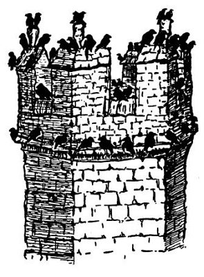

<section>

Písmo svaté praví sice zcela zřejmě: „Ac efe a ddywedodd hefyd wrth y bobloedd. Pan weloch gwmmwl yn codi o’r gorllewin, yn y fan y dywedwch, Y mae cawod yn dyfod; ac felly y mae.“ (Luk. XIII, 54.)

Ač tedy Bible waleská toto říká o západním větru, vydal jsem se při západním větru na horu Snowdon čili správně Eryri Y Wyddfa, abych viděl celou zemi Waleskou. Ac felly y mae: nejen pršelo, ale ocitl jsem se v mracích a takové zimě, že na temeni Snowdonu jsem se uchýlil ke kamnům; oheň je totiž velmi krásný na pohled a při řeřavějícím uhlí lze myslit na spoustu nejlepších věcí. Průvodce chválí krásu a rozmanitost vyhlídky z hory Snowdon; viděl jsem bílá a šedá mračna, dokonce jsem je cítil až pod košilí; na pohled to není přímo ošklivé, neboť je to bílé; ale příliš rozmanité to není. Nicméně bylo mi přáno spatřiti Lliwedd a Moel Offrwn i Cwm-y -Llan i Llyn Ffynnon Gwas i Grib-y -ddysgyl; i řekněte, nestojí-li tato krásná jména za trochu toho mžení, vichřice, zimy a mračen.

  

Pokud se týče jazyka Walesanů, je poněkud nesrozumitelný, a jak mi vykládal můj učený přítel, také složitý; dejme tomu otci se říká jednou „dad“, jindy „tad“ a jindy zase „nhad“, podle okolností. Že je to jazyk složitý, je vidět z toho, že jedna vesnice blíže Anglesey se jmenuje prostě Llanfairpwllgwyngyllgogerychwyrndrobwllllantysiliogogogoch. Abyste věděli, waleská keltština se pěkně poslouchá, zejména z úst tmavovlasých děvčat typu bezmála francouzského. Staré Walesanky však nosí pohříchu mužské čepice; je to patrně zbytek domácího kroje, k němuž náležel u žen nesmírně vysoký mužský cylindr.

Jinak není Wales vůbec tak divný a strašný jako jeho místní jména. Jedno místo se jmenuje Paenmaenmawr a jsou tam jen lomy a mořské lázně. Já nevím, proč mají některá jména na mne magický účinek; musil jsem vidět Llandudno, a byl jsem zdrcen; předně se to vyslovuje jinak, a za druhé je to jen hromada hotelů, skal a písku jako kterékoliv jiné mořské lázně tohoto ostrova. I zalezl jsem až do Carnarvonu, hlavního města Walesanů; to je tak daleko, že už tam na poště nevědí o naší zemi a že tam v sedm hodin nedostanete večeři; já nevím, proč jsem tam byl celé dva dny. Mají tam veliký starý hrad princů waleských; byl bych jej nakreslil, ale nevešel se mi na papír; i nakreslil jsem aspoň jednu jeho věž, kde právě zasedal autonomní kavčí parlament. Jakživ jsem neviděl a neslyšel tolik kavek; říkám vám, musíte jet do Carnarvonu.

  

Wales je země hor, Lloyda George, pstruhů, výletníků, černých krav, břidlice, hradů, deště, bardů a keltského jazyka. Ty hory jsou lysé a fialové, divné a plné kamení; v hotelích jsou provlhlé fotografie pořadatelů pěveckých závodů, jež jsou jaksi zdejší národní specialitou; waleské ovce mají dlouhé ocasy, a kdybyste mne rozkrájeli, je to všechno, co vím o Severním Walesu. Komu se to zdá málo, jářku, ať jede do Carnarvonu. V Bangoru se přesedá.

</section>
