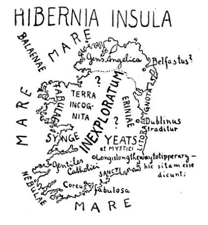

<section>

#### I.

</section>

<section>

Chtěl jsem vlastně psáti listy z Irska; dokonce tam nemám dále než mizerných několik hodin; proč tam nejedu, není ani mně zcela jasno. Myslím, že je tím vinna irská otázka.

Položil jsem irskou otázku skoro všem Angličanům, Skotům, Kymrům i Galům, s kterými jsem se setkal; ptal jsem se jich, co vlastně mám v Irsku vidět a kam zamířit; zdá se mi, že jim tato otázka byla jaksi nepříjemná. Řekli mi, abych jel raději do Oxfordu nebo do Stratfordu-on-Avon nebo do mořských lázní. I vzplanula má zvědavost tím silněji.

„Jeďte na sever,“ radil mi jeden.

„Jeďte na západ,“ radil mi druhý jaksi bez nadšení.

„Jeďte na jih,“ děl třetí, „já tam sice nebyl, ale když už tam chcete jet…“

#### II.

</section>

<section>

Otázka: Já bych se rád podíval do Irska. Co tomu říkáte?

Odpověď: Ah eh eh eh oh oh. Eh?

Otázka: Cože?

Odpověď: Že tam není docela klidno.

Otázka: Je to tak zlé?

Odpověď: Nu, taky tam vyhazují mosty do povětří, a když jede vlak – –

Otázka: Vyletí každý vlak do vzduchu?

Odpověď (poněkud nejistě): Ne, každý ne. Víte co? Jeďte do Belfastu. Tam to máte skoro jako tady…

#### III.

</section>

<section>

Mr. Shaw pak radil jen jediné místo v Irsku; je to malý ostrůvek na jihu, jehož jméno jsem zapomněl. Tam prý je lid velmi zachovalý; bohužel, dodal Mr. Shaw, na řečeném ostrůvku není možno přistát.

#### IV.

</section>

<section>

Dobrá, podíváš se tam na vlastní pěst. Koupíš si nějakého průvodce po Irsku, vybereš si několik pěkných míst a budeš psát listy z Irska.

Od Glasgowa počínajíc běhám po všech knihkupcích a kupuji průvodce po Irsku. Ale knihkupec vrtí povážlivě hlavou; ne, nemá žádného průvodce po Irsku. Má průvodce po Cornwallu a Dukeries, po Snowdonii a výstavě ve Wembley, ale náhodou zrovna nic o Irsku, sorry, docela nic. „Naši lidé tam nejezdí.“

  

#### V.

</section>

<section>

Mizerných několik hodin mám odtud do Irska; ale řekněte, mám pro nic a za nic zahodit strašné tajemství, kterým je pro mne tato země obestřena? I budu se povždy s láskou a radostí dívat na mapu Irska: Hle, země, z níž jsem roušky nesňal.

</section>

[^1]: Punch – tehdejší humoristický časopis. _Pozn. red._

[^2]: Damara – pryskyřice z damaroně nebo jiných asijských stromů. _Pozn. red._

[^3]: Svislý, kolmý; zde označení slohu z doby pozdní angl. gotiky. _Pozn. red._

[^4]: Chrámová skladba, kantáta. _Pozn. red._

[^5]: Eli, Eli, lama sabachtani! – parafráze posledních slov utrpení Ježíše Krista (Bože můj, proč jsi mě opustil!) _Pozn. red._

[^6]: Wynds nebo closes (skot. dialekt) – úzké cesty k domkům ve starém Edinburghu. _Pozn. red._

[^7]: Gleny – horské rokle, úžlabiny. _Pozn. red._

[^8]: Terra hyberborea – podle starověké představy Země blaha. _Pozn. red._

[^9]: Vyhlídkové otevřené autokary. _Pozn. red._

[^10]: Z franc. clavecin – cembalo, starý klávesový hudební nástroj. _Pozn. red._

[^11]: Smetanový vaječný krém. _Pozn. red._

[^12]: Ostrovní. _Pozn. red._
